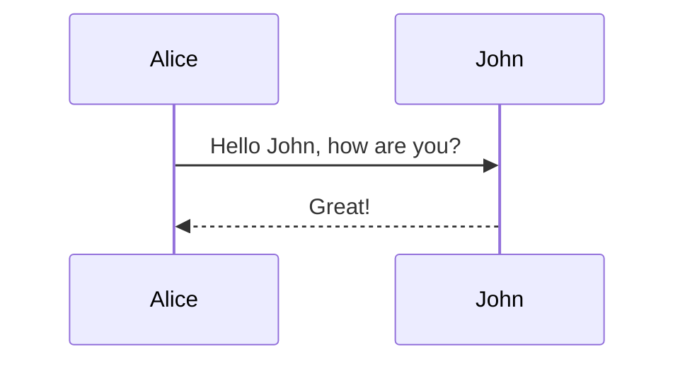

이 문서는 Quartz 블로그 포스팅 시 사용하는 핵심 문법(링크, 코드, 수식, 시각화 등)을 정리한 매뉴얼입니다.

---

## 1. 링크 및 임베드 (Wikilinks)
Obsidian 스타일의 링크 문법을 지원하며, 내부적으로 `CrawlLinks` 플러그인이 처리합니다.

### 기본 링크 (Internal Links)
* **기본 연결:** `[[파일경로]]` -> `파일경로`라는 텍스트로 연결.
* **텍스트 변경:** `[[파일경로|보여줄 텍스트]]` -> `보여줄 텍스트`로 링크 생성.
* **특정 헤더로 이동:** `[[파일경로#헤더제목]]`.
* **특정 블록으로 이동:** `[[파일경로#^블록ID]]`.

### 임베드 (Embeds) - 이미지 및 문서 삽입
느낌표(`!`)를 붙이면 해당 내용을 페이지 안에 삽입(Transclusion)합니다.

* **이미지 삽입:** `![[image.png]]`.
* **이미지 크기 조절:** `![[image.png|100x145]]` (너비 100px, 높이 145px).
* **문서 전체 삽입:** `![[다른문서]]` -> 해당 문서의 내용이 통째로 들어옵니다.
* **특정 부분 삽입:** `![[다른문서#^blockid]]`.

---

## 2. 코드 블록 및 하이라이팅 (Syntax Highlighting)
Quartz는 빌드 타임에 코드를 계산하여, VS Code와 동일한 수준의 하이라이팅을 제공합니다.

### 기본 작성법
백틱 3개 뒤에 언어를 적습니다.

### 고급 기능 (Metadata)
코드 블록의 첫 줄에 속성을 추가하여 다양한 기능을 씁니다.

**1) 파일 제목 표시 (`title`)**
````
```ts title="quartz/path.ts"
console.log("Hello")
```
````

- 작성법: ` ```ts title="파일경로" `.
    

**2) 특정 라인 강조 (`{}`)**


```TypeScript
const a = 1; // 강조됨
const b = 2;
const c = 3; // 강조됨
const d = 4; // 강조됨
```

- 작성법: ` ```ts {1, 3-4} ` (1번 줄과 3~4번 줄 강조).
    

**3) 특정 단어 강조 (`//`)**


```JavaScript
const [age, setAge] = useState(50);
```

- 작성법: ` ```js /Regex/ ` (정규표현식으로 단어 강조).
    

**4) 줄 번호 시작점 변경**

- 작성법: ` ```js showLineNumbers{20} ` (20번부터 줄 번호 시작).
    

**5) 인라인 코드 하이라이팅**

문장 중간에 있는 코드에 색상을 입힐 때 씁니다.

- 작성법: `` `const a = 1`{:js} `` (코드 뒤에 `{:언어}` 붙이기).
    

---

## 3. 콜아웃 (Callouts)

Obsidian의 Admonition 문법을 지원합니다. 12가지 타입이 있습니다.

### 작성법


```Markdown
> [!info] 제목
> 여기에 내용을 적습니다.
```

### 접기/펼치기 (Collapsable)

- **기본 펼침:** `> [!info]+ 제목` (플러스 기호).
- **기본 접힘:** `> [!info]- 제목` (마이너스 기호 - 클릭해야 보임).

### 지원 타입 (Aliases)

각 타입은 여러 가지 별칭(Alias)으로도 쓸 수 있습니다.

- **Note:** `note`
- **Info:** `info`
- **Todo:** `todo`
- **Tip:** `tip`, `hint`, `important`
- **Success:** `success`, `check`, `done`
- **Question:** `question`, `help`, `faq`
- **Warning:** `warning`, `caution`, `attention`
- **Failure:** `failure`, `fail`, `missing`
- **Danger:** `danger`, `error`
- **Bug:** `bug`
- **Example:** `example`
- **Quote:** `quote`, `cite`

---

## 4. 수식 (LaTeX)

수학 수식을 작성할 때 사용합니다. `Katex` 라이브러리를 사용합니다.

### 블록 수식 (Block Math)

`$$`로 감싸되, **반드시 줄바꿈**을 해야 합니다.


```Markdown
$$
f(x) = \int_{-\infty}^\infty f\hat(\xi),e^{2 \pi i \xi x} \,d\xi
$$
```

### 인라인 수식 (Inline Math)

문장 중간에 쓸 때는 `$` 하나로 감쌉니다.

- 작성법: `$e^{i\pi} = -1$`

### 이스케이프 (Escaping)

수식이 아니라 진짜 달러 기호($)를 쓰고 싶을 땐 역슬래시를 붙입니다.

- 작성법: `\$100`.
    

---

## 5. 다이어그램 (Mermaid)

플로우차트, 시퀀스 다이어그램 등을 코드로 그립니다.

### 작성법

````Markdown

````

> [!WARNING] 주의사항
> 
> 만약 콜아웃이나 머메이드 다이어그램이 제대로 안 보인다면, `quartz.config.ts`의 플러그인 순서에서 `ObsidianFlavoredMarkdown`이 `SyntaxHighlighting`보다 **뒤에** 있는지 확인하세요.

---

## 6. 인용 및 참고문헌 (Citations)

논문이나 외부 자료를 인용할 때 사용합니다 (`Citation` 플러그인 활성화 필요).

### 사용법

1. `bibliography.bib` 파일에 BibTex 형식으로 논문 정보를 저장합니다.
2. 글에서 `[@논문키]` 형식으로 인용합니다. 예: `[@templeton2024scaling]`.
3. 빌드 시 `(Templeton et al., 2024)` 형태로 자동 변환됩니다.


```Markdown
> [!NOTE] 참고문헌 위치
> 기본적으로 참고문헌 목록은 글 맨 끝에 생성되지만, `[^ref]`를 사용하여 위치를 지정할 수 있습니다.
```

