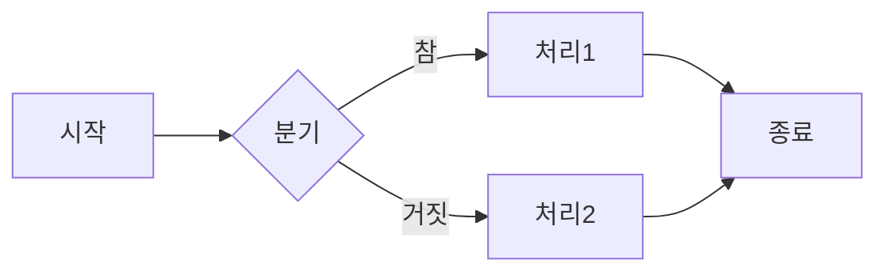

# 깃 페이지 첫 포스팅 및 양식 알아보기

이 글은 [Chirpy 테마 공식 문서](https://chirpy.cotes.page/posts/write-a-new-post/)를 바탕으로 **새 글 작성하기**에 대한 전반적인 내용을 소개합니다. GitHub Pages에서 **Jekyll** 기반 **Chirpy 테마**를 사용해 간단히 게시글을 작성하고, 여러 확장 기능을 활용할 수 있는 방법을 단계별로 알아보겠습니다.

---

## 1. 새 글 작성 방법

### 1.1 `_posts` 폴더 및 파일명 규칙

**기본 위치**: `_posts` 폴더에 Markdown 파일을 생성합니다.  
**파일명 형식**: `YYYY-MM-DD-슬러그.md` (날짜-슬러그 형식)  
예시 구조:
```bash
_posts
└── 2025-02-13-first.md
```

### 1.2 Front Matter 설정
Markdown 파일 최상단에 **YAML** 형태로 **메타데이터**(Front Matter)를 배치합니다. 주요 설정값 예시는 아래와 같습니다:
```yaml
---
title: "포스트 제목"
date: YYYY-MM-DD HH:MM:SS +/-TTTT
categories: [카테고리, 서브카테고리]
tags: [태그1, 태그2]
pin: true
toc: true
comments: true
math: true
image:
  path: thumbnail.png
  alt: image alternative text
---
```
- title : 게시글 제목
- data : 작성/발행 날짜
- categories : 카테고리 계층 구조(최상위/하위 등)
- tags : 글과 관련된 태그, 검색용 키워드
- pin : `true`로 설정 시 메인 페이지 상단 고정
- toc : `true`면 글 내부에 자동으로 목차(Tabel Of Contents) 표시
- comments : `true`시 Disqus 등의 댓글 기능 활성화
- math : `true`시 수학 기능 활성화
- image : `path:`에 썸네일 이미지의 경로를 넣어 썸네일을 추가. `1200 x 630` 해상도와 `1.91 : 1` 비율을 권장함. `alt:`에는 이미지 대체 텍스트를 추가.

---

## Markdown 및 Chirpy 확장 기능
### 2.2 일반 Markdown 문법
- **굵게** : \`\*\*텍스트\*\*\` → **텍스트**  
- *기울임* : \`\*텍스트\*\` → *텍스트*  
- ~~취소선~~ : \`\~\~텍스트\~\~\` → ~~텍스트~~  
- **링크** : \`\[링크텍스트\]\(https://example.com\)\`  
- **이미지** : \`\!\[대체텍스트\]\(이미지경로.jpg\)\`

### 2.2 코드 블록

형식으로 작성하면, 언어별 **문법 강조**가 가능합니다.

\`\`\`python
def hello_world():
    print("Hello, World!")
\`\`\`

**렌더링 결과**:

```python
def hello_world():
    print("Hello, World!")
```

---

### 2.3 수식(Math) 표현

Chirpy는 **MathJax**를 통해 LaTeX 스타일 수식을 지원합니다.

- **인라인 수식** 문법 예시:

```
$E = mc^2$
```

**렌더링 결과**:

$E = mc^2$

- **블록 수식** 문법 예시:

```
$$
\int_{0}^{1} x^2 \, dx = \frac{1}{3}
$$
```

**렌더링 결과**:

$$
\int_{0}^{1} x^2 \, dx = \frac{1}{3}
$$

---

### 2.4 Mermaid 다이어그램

아래처럼 `mermaid` 코드 블록을 작성하면, Markdown 렌더링 시 다이어그램으로 표시됩니다.

\`\`\`mermaid
flowchart LR
    A[시작] --> B{분기}
    B -->|참| C[처리1]
    B -->|거짓| D[처리2]
    C --> E[종료]
    D --> E[종료]
\`\`\`

**렌더링 결과**:



위 코드는 실제 페이지에서 **다이어그램**으로 시각화됩니다.

---

### 2.5 테이블

기본 Markdown 테이블 문법 예시:

```
| 헤더1 | 헤더2 | 헤더3 |
|:----:|:----:|:----:|
| 셀1  | 셀2  | 셀3  |
| 셀4  | 셀5  | 셀6  |
```

**렌더링 결과**:

| 헤더1 | 헤더2 | 헤더3 |
|:----:|:----:|:----:|
| 셀1  | 셀2  | 셀3  |
| 셀4  | 셀5  | 셀6  |

---

### 2.6 각주 기능[^1]

본문에 `[^각주]` 형태로 표시한 뒤, 아래와 같이 본문 하단에서 설명을 추가할 수 있습니다:

```
이 문장은 각주의 예시입니다[^1].

[^1]: 이 문장은 각주의 구체적인 설명입니다.
```

**렌더링 결과**(일반적으로 페이지 하단에 각주가 생깁니다):

이 문장은 각주의 예시입니다[^1].

[^1]: 이 문장은 각주의 구체적인 설명입니다.

---

## 3. Disqus 댓글 설정

1. `_config.yml` 혹은 `comments.yml`(버전에 따라 상이)에서 **Disqus shortname** 등을 설정  
2. 글의 Front Matter에 `comments: true` 추가 → 해당 게시글에 댓글 사용 가능  

> **Note**  
> 버전마다 설정 방법이 다를 수 있으니, Chirpy 공식 문서나 Disqus 공식 안내를 참고하세요.

---

## 4. Liquid 템플릿 & 치환

Jekyll은 **Liquid 템플릿 엔진**을 사용합니다.  
본의 아니게 `{{ }}` 구문이 **치환**되는 것을 막으려면, Front Matter에 `render_with_liquid: false` 옵션을 줄 수도 있습니다.

```yaml
---
title: "Liquid 예시"
render_with_liquid: false
---
```

이렇게 하면 본문 내 `{{ some_variable }}`가 실제 값으로 변환되지 않고 그대로 표시됩니다.

---

## 5. 빌드 및 배포

### 5.1 로컬에서 빌드하기

```bash
bundle exec jekyll serve
```

이 명령으로 로컬 서버가 열리면, [http://127.0.0.1:4000](http://127.0.0.1:4000)에서 사이트를 미리보기할 수 있습니다.

### 5.2 GitHub Pages 배포

로컬 테스트 후, 깃허브 리포지토리에 푸시하면 **GitHub Pages**가 자동으로 빌드/배포를 진행합니다.  
빌드 상태는 **GitHub Actions** 메뉴에서 확인 가능합니다.


## 6. 참고 자료

- **Chirpy 공식 문서**: [https://chirpy.cotes.page/](https://chirpy.cotes.page/){:target="_blank"}  
- **Github 레포지토리**: [https://github.com/cotes2020/jekyll-theme-chirpy](https://github.com/cotes2020/jekyll-theme-chirpy){:target="_blank"}

> **중요**  
> 버전이나 환경 설정에 따라 일부 기능의 사용법이 다를 수 있으니, 반드시 **공식 문서**를 참고하세요.

---

## 마무리 요약

- **파일 생성**: `_posts` 폴더에 `YYYY-MM-DD-슬러그.md`  
- **Front Matter**: `title, date, categories, tags, pin, toc, comments` 등 사용  
- **본문**: Markdown 기본 + Chirpy 확장 기능(코드블록, 수식, 다이어그램, 테이블, 각주 등)  
- **빌드/배포**: 로컬 `bundle exec jekyll serve`로 미리보기 후, 깃허브 푸시로 자동 반영  

[^1]: 이 문장은 각주의 예시입니다.