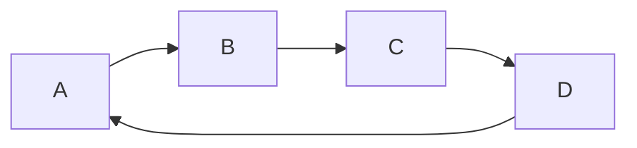

<!-- 본문 작성 -->
## 파일 이름
- 새로운 파일 이름은`"YYYY-MM-DD-TITLE.EXTENSION"` 형식으로 설정.
- EXTENSION은 `.md` 혹은 `.markdown` 으로 해야 함.
- `_posts` 폴더 안에 포스팅할  파일을 넣으면 포스팅 완료.
- `Jekyll-Compose` 플러그인을 사용할 것을 고려해도 됨.

## 프론트 매터 (Front Matter)
- 기본적으로 글 상단에 아래와 같이 yaml 형식의 글을 채워야 함
```yaml
---
title: TITLE
date: YYYY-MM-DD HH:MM:SS +/-TTTT # 표준 시간대 설정
categories: [TOP_CATEGORIE, SUB_CATEGORIE]  # 폴더의 개념
tags: [TAG]     # TAG 명은 반드시 항상 소문자여야 함.
---
```

## 표준 시간대
- 글의 공개 날짜를 정확하게 기록하기 위해선, `_config.yml` 에서 표준 시간대를 설정해야 함.
- 뿐만 아니라, 글의 프론트매터에도 `date` 의 value 값으로 표준 시간대를 설정해야 함.
- 한국의 표준 시간대는 `UTC+09:00` 으로, `+0900`을 입력하면 됨.

## 카테고리 및 태그
- 각 글의 카테고리는 최대 2개의 요소를 포함하도록 설계됨.(상위폴더 및 하위폴더)
- 태그의 개수는 0개에서 무한대까지 가능함
```yaml
---
categories: [Animal, Insect] # Insect의 더 하위폴더는 불가능.
tags: [bee]
---
```

## 작성자 정보
- 글의 작성자 정보는 프론트 매터에 입력할 필요 없음.
- 기본적으로 `_config.yml` 파일에 있는 social.name 변수 및 social.links 변수에서 가져옴.
- 그러나 `data/authors.yml` 파일에서 재정의할 수 있음

## 포스트 설명
- 기본적으로 글(포스트)의 첫 단어는 홈페이지의 글 리스트, `Further Reading` 섹션 및 RSS 피드의 XML에 표시되는 데 사용됨.
- 설명 텍스트는 글 페이지의 제목 아래에도 표시됨.
- 글에 대한 설명을 설정하려면 다음과 같이 프론트 매터를 통해 가능.
```yaml
---
description: Short summary of the post.
---
```

## 목차 (Table Of Contents, TOC)
- 기본적으로 목차(TOC)는 글의 오른쪽 패널에 표시됨.
- 이 기능을 전역적으로 끄려면 `_config.yml`에서 `defaults:` 영역에 있는 toc 변수의 값을 `false`로 설정.
- 전역적이 아닌, 특정 글에 대한 TOC를 끄려면 글의 프론트 매터에 다음을 추가.
```yaml
---
toc: false
---
```

## 댓글 (Comments)
- 댓글에 대한 전역 설정은 `_config.yml` 파일의 comments.provider 옵션으로 정의.
- 이 변수에서 댓글 시스템의 provider를 설정하면 모든 글에 댓글이 활성화 됨.
- 특정 글에 대한 댓글을 닫으려면 글의 프론트 매터에 다음을 추가.
```yaml
---
comments: false
---
```

## URL 접두사(Prefix)
- 두 개의 매개변수 설정을 통해, 글의 여러 리소스에 대해 중복된 URL 접두사를 정의할 수 있음.
- `cdn`을 사용하여 미디어 파일을 호스팅하는 경우 `_config.yml`에서 cdn을 지정할 수 있음. 그러면 사이트의 아바타나 포스트에 포함된 미디어 리소스들의 URL들이 cdn 도메인 이름으로 접두사가 붙음.
```yaml
cdn: https://cdn.com
```

- 현재 포스트나 페이지 범위에 대한 리소스 경로 접두사를 지정하려면, 포스트의 프론트 매터에 `media_subpath`를 설정.
```yaml
---
media_subpath: /path/to/media/
---
```
- `site.cdn`과 `page.media_subpath` 옵션은 개별적으로 사용하거나 함께 결합하여 최종 리소스 URL을 유연하게 구성할 수 있습니다. 최종 URL은 다음과 같은 형식으로 구성됩니다:  
	`[site.cdn/][page.media_subpath/]file.ext`

## Images
### 캡션 (Caption)
- 이미지 아래에 이탤릭체로 다음 줄을 추가하면 캡션이 되어 이미지 하단에 표시됨.
```markdown
  
_Image Caption_
```

### 크기
- 이미지를 로드할 때 페이지 레이아웃이 이동하는 것을 방지하려면 각 이미지에 대해 가로 및 세로 크기를 설정해야 함.
```markdown
{: width="700" height="400" }
```
- SVG의 경우, 최소 가로 크기를 지정해야만 렌더링 됨.
- 높이와 너비의 약어 `height -> h`, `width -> w`를 지원함.
- 다음 예시는 위와 동일한 효과를 가짐.
```markdown
{: w="700" h="400" }
```

### 위치 (location)
- 기본적으로 이미지는 중앙에 위치하지만, `normal`, `left`, `right` 클래스를 사용하여 위치를 지정할 수 있음.

>위치를 지정한 후에는 이미지 캡션을 추가하지 않아야 함.
{: .prompt-warning}

- 정상 위치
: 이미지는 기본적으로 중앙에 배치되지만, 아래 예시처럼 다양하게 정렬 가능
```markdown
{: .normal }
```

- 왼쪽 정렬 이미지
```markdown
{: .left }
```

- 오른쪽 정렬 이미지
```markdown
{: .right }
```

### 다크/라이트 모드
- 이미지가 다크/라이트 모드를 따르도록 설정할 수 있음.
- 이를 위해선 다크 및 라이트 모드 각각에 맞는 이미지를 준비하고, 각 이미지에 `dark`, `light` 클래스를 지정해야 함.
```markdown
{: .light }
{: .dark }
```

### 미리보기 이미지 (썸네일)
- 포스트 상단에 이미지를 추가하려면 해상도가 `1200 x 630`인 이미지가 필요함.
- 이미지의 가로세로 비율이 `1.91 : 1`에 맞지 않으면 이미지가 크기 조정되고, 잘리게 됨.
```yaml
---
image:
  path: /path/to/image
  alt: 이미지 대체 텍스트
---
```
- 단순한 사용을 위해선, `image`만으로 경로를 정의할 수도 있음.
```yaml
---
image: /path/to/image
---
```

## Pinned Posts (포스트 고정)
- 홈페이지 상단에 하나 이상의 포스트를 고정할 수 있음.
- 고정된 포스트는 게시된 날짜를 기준으로 역순으로 정렬됨.
```yaml
---
pin: true
---
```

## Prompt (콜아웃 기능)
- 프롬프트는 여러 종류가 있으며, `tip`, `info`, `warning`, `danger`로 구분됨.
- 각 유형의 프롬프트는 `blockquote`에 클래스를 추가하여 생성 가능.
- 예를 들어, `info` 유형의 프롬프트를 정의하려면 아래와 같이 작성합니다:

```markdown
> Example line for prompt.
{: .prompt-info }
```

## Syntax
### Inline Code
```markdown
`inline code part`
```

### Filepath Highlight
```markdown
`/path/to/a/file.extend`{: .filepath}
```

### Line Number
- 기본적으로 `plaintext`, `console`, `terminal`을 제외한 모든 언어는 코드 블록에 라인 번호가 표시됨.
- 그러나 만약 코드 블록에서 라인 번호를 숨기고 싶다면, 해당 블록에 `nolineno` 클래스를 추가함.

````markdown
```shell
echo 'No more line numbers!'
```
{: .nolineno }
````

### Filename 지정하기
- 코드 블록 상단의 코드언어가 표시되는 것을 파일 이름으로 변경 가능.

````markdown
```shell
# content
```
{: file="path/to/file" }
````

## Mathematics
- MathJax를 사용하여 수학식을 생성함.
- 수학 기능은 기본적으로 활성화되지 않기에, 이를 아래와 같이 설정해야 함.

```yaml
---
math: true
---
```

- 다음과 같은 구문을 사용하여 수학식을 본문에 추가할 수 있음
	- **Block math**는 `$$ math $$` 형식으로 작성해야 하며, `$$` 입력 전과 후에 빈 줄이 반드시 필요함.
	- 수식 번호를 추가하려면 반드시 `$$\begin{equation} math \end{equation}$$` 형식으로 작성해야 함.
	- 수식 블록 내에서는 `\label{eq:label_name}`을 사용하여 번호를 지정하고, 텍스트 내에서는 `\eqref{eq:label_name}`로 참조할 수 있음.
	- 라인 내 인라인 수학식은 `$$ math $$`로 추가하며, 그 앞 뒤로 빈 줄을 넣지 않음.
	- 목록 내 인라인 수학식은 `\$$ math $$`로 추가해야 함.

```markdown
<!-- Block math, keep all blank lines -->

$$
LaTeX_math_expression
$$

<!-- Equation numbering, keep all blank lines  -->

$$
\begin{equation}
  LaTeX_math_expression
  \label{eq:label_name}
\end{equation}
$$

Can be referenced as \eqref{eq:label_name}.

<!-- Inline math in lines, NO blank lines -->

"Lorem ipsum dolor sit amet, $$ LaTeX_math_expression $$ consectetur adipiscing elit."

<!-- Inline math in lists, escape the first `$` -->
1. \$$ LaTeX_math_expression $$
2. \$$ LaTeX_math_expression $$
3. \$$ LaTeX_math_expression $$
```

>MathJax의 구성 옵션은 `assets/js/data/mathjax.js` 파일을 수정하여 필요에 맞게 옵션을 변경 가능. 예를 들어, 확장을 추가할 수 있음.
{: .prompt-tip}

## Mermaid (다이어그램 생성 도구)
- Mermaid를 사용하려면 프론트 매터에서 활성화 필요.
```yaml
---
mermaid: true
---
```
- 그 후, 다른 markdown 언어처럼 다이어그램 코드를 ` ```mermaid `와 ` ``` `로 감싸서 사용할 수 있음.
````markdown

````

