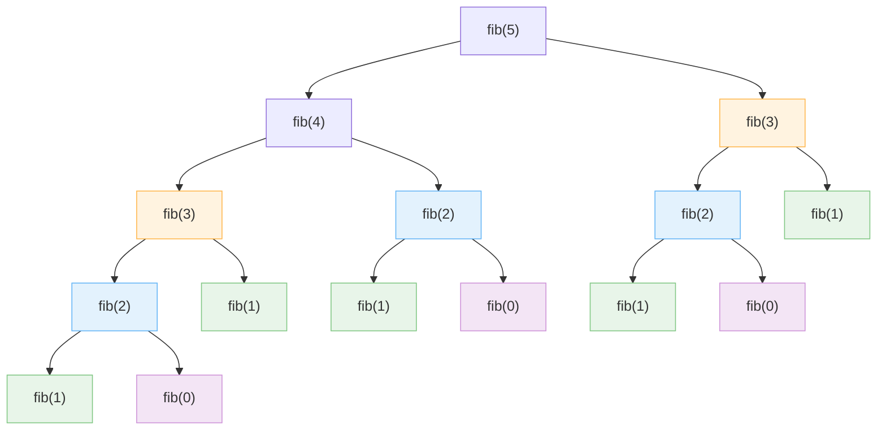

---
# 포스트 제목
title: "[Algorithms] 1-1: 효율적인 알고리즘이란?"

# 포스트 생성 시간
date: 2025-06-23 20:11:00 +09:00

# 포스트 최종 수정 시간
last_modified_at: 2025-06-23 20:11:00 +09:00

# 카테고리: [상위, 하위] 형식
categories: [Academics, Algorithms]

# 태그: 소문자로, 쉼표로 구분
tags: [algorithm, efficiency, time complexity, fibonacci]

# 포스트 요약 설명 (검색엔진 및 소셜 공유 시 표시됨)
description: "알고리즘의 효율성이 왜 중요한지에 대해 알아봅니다."

# 썸네일 이미지 설정
image:
  # path: 
  # alt: # 썸네일 이미지 로드 전 이미지 대체 텍스트
  # lqip: # 저해상도 썸네일 이미지 경로

# --- 기능 활성화 여부 ---
toc: true      # 우측에 목차 표시
comments: true # 하단에 댓글창 표시
pin: false     # 메인 페이지에 고정
math: true    # 수학 수식(LaTeX) 렌더링 활성화 (필요시 true로 변경)
mermaid: true # Mermaid 다이어그램 렌더링 활성화 (필요시 true로 변경)
---

> 본 포스팅은 학부 '알고리즘' 강의에서 배운 내용을 바탕으로 재구성하여 정리한 글입니다.  
> 내용에 오류 혹은 오탈자가 있다면 댓글로 알려주시면 감사하겠습니다.

알고리즘의 효율성은 왜 중요할까요?  
똑같은 문제를 해결하더라도 어떤 알고리즘을 사용하느냐에 따라 그 성능에 차이가 존재합니다.  
우리가 작성하는 코드가 단지 '동작하는 것'을 넘어, '잘 동작하는 것'이 되려면 효율성에 대한 이해가 필요합니다.

이번 포스트에서는 알고리즘의 기본적인 정의부터 시작해, 몇 가지 구체적인 예시를 통해 효율적인 알고리즘을 설계하는 것이 왜 중요한지 알아보겠습니다.

---

## 1. 알고리즘$^{\text{Algorithm}}$이란?

알고리즘이란 무엇일까요?

결론부터 말하면, <u>알고리즘이란 Problem Instance를 해결하기 위한 Step-by-Step 절차</u>라고 할 수 있습니다.

이 문장을 제대로 이해하기 위해 몇 가지 용어들의 정의를 살펴보겠습니다.

-   **<u>문제 (Problem)</u>**
    -   우리가 답을 구하고자 하는, 변수가 포함된 일반적인 '질문'을 의미합니다.
    -   *예시: "주어진 `n`개의 수로 이루어진 리스트 `S`에서 특정 숫자 `x`가 포함되어 있는지 확인하시오."*

-   **<u>문제 인스턴스 (Problem Instance)</u>**
    -   문제의 각 변수(parameter)에 구체적인 값이 할당된 상태.
    -   즉, <u>문제의 구체적인 사례(case)</u>를 의미합니다.
    -   *예시: "주어진 리스트 `S = [22, 5, 11, 41, 19, 28]`에서 `x = 19`가 포함되어 있는지 확인하시오."*

-   **<mark>알고리즘 (Algorithm)</mark>**
    -   주어진 `문제 인스턴스`를 해결하기 위한, 명확하게 정의된 <u>단계별 절차(Step-by-Step Procedure)</u>입니다.
    -   *예시: 위 문제 인스턴스를 해결하기 위해 '순차 탐색 알고리즘'을 사용한다.*

---

> 이 용어들의 관계를 **'길 찾기'** 예시에 빗대어 표현해 보겠습니다.

먼저, 우리가 해결해야 할 **<u>문제(Problem)</u>**는 'A에서 B까지 가는 길을 찾아라'와 같이, 목표를 정의하는 일반적인 질문입니다.

하지만 이 '문제'만으로는 너무 추상적이어서 실제 행동에 나설 수 없습니다.  
구체적으로 '어디에서' 출발해서 '어디로', '어떤 조건으로' 갈 것인지가 주어져야 합니다.  
바로 이 추상적인 질문을 구체화한 것이 **<u>문제 인스턴스(Problem Instance)</u>**입니다. 

같은 문제라도 조건을 어떻게 설정하느냐에 따라 수많은 인스턴스가 생길 수 있습니다:

-   **인스턴스 1**: "<u>서울역에서 자동차로</u> 출발하며, <u>고속도로 통행료는 상관없으니</u> 해운대 해수욕장까지 가장 빠른 길로 가고 싶다."
-   **인스턴스 2**: "<u>동대문구에서 대중교통으로</u> 출발하며, <u>최소 환승</u>으로 마포구청까지 가고 싶다."

만약 '인스턴스 1'을 해결해야 하는 상황이라고 가정하면,  
이 구체적인 문제를 해결하는 방법, 즉 **<u>알고리즘(Algorithm)</u>** 역시 여러 가지가 있을 수 있습니다:

-   **알고리즘 A (최단 시간 우선)**: 내비게이션 앱이 추천하는, 현재 교통 상황을 반영하여 도착 시간이 가장 빠른 경로.
-   **알고리즘 B (최소 비용 우선)**: 통행료가 가장 저렴하거나 없는 무료 도로를 우선하여 안내하는 경로.
-   **알고리즘 C (최단 거리 우선)**: 실제 주행 거리가 가장 짧은 경로 (시간이 더 걸릴 수 있음).

> 위 내용을 정리해보면,
> 
> -   하나의 **'문제'**에는 무수히 많은 **'문제 인스턴스'**가 존재할 수 있습니다.
> -   그리고 하나의 **'문제 인스턴스'**를 해결하는 **'알고리즘'** 또한 여러 개가 존재할 수 있습니다.
> 
> 바로 여기서 <u>'효율적인 알고리즘'</u>의 중요성이 드러납니다.
> 
> '최단 시간 경로'와 '최소 비용 경로' 중 어떤 것이 더 '좋은' 알고리즘인지는 운전자의 '상황'과 '목표'에 따라 달라집니다.
> 
> 예를 들어,  
> 빠르게 가야하는 사람은 알고리즘 A를,  
> 싼 가격을 원하는 사람은 알고리즘 B를 선택할 것입니다.
> 
> 결국 우리는 단순히 '작동하는' 알고리즘을 넘어, 주어진 상황에서 **최선의 결과를 내는 '효율적인' 알고리즘을 선택하고 설계**할 수 있어야 합니다.
{: .prompt-info}

---

## 2. 효율성 체감하기: 두 가지 접근법

그렇다면 여러 알고리즘 중 어떤 것이 '더 나은' 선택일까요?  

### 사례 1: 도서관에서 책 찾기 (탐색 알고리즘)

수많은 책이 꽂힌 도서관에서 특정 책 한 권을 찾는 상황을 가정해 보겠습니다.

#### 접근법 A: 순차 탐색 (Sequential Search)

가장 단순하고 직관적인 방법입니다.  
도서관 입구 첫 번째 책장, 첫 번째 칸부터 시작해서 책 제목을 하나하나 확인하며 끝까지 찾아
봅니다.

```java
public static int SequentialSearch (int listSize, int[] dataList, int target) {
    int location = 0; // 배열 인덱스는 0부터 시작한다고 가정
    while (location < listSize && dataList[location] != target) {
        location++;
    }

    if (location >= listSize) {
        return -1; // 찾지 못했을 경우
    } else {
        return location;
    }
}
```

이 방법은 간단하지만, 운이 나쁘면 도서관의 모든 책을 다 뒤져야만 결과를 알 수 있습니다.  
즉, 데이터의 개수 $n$ (`listSize`)에 정비례하여 시간이 걸립니다.  
다르게 표현하면, 최악의 경우 **$O(n)$의 시간 복잡도**를 가집니다.

#### 접근법 B: 이진 탐색 (Binary Search)

이전 순차 탐색에 비해 훨씬 똑똑한 방법입니다.  
이 알고리즘은 한 가지 매우 중요한 <u>전제 조건</u>이 필요합니다.

> **전제 조건**:  
> 입력 리스트 `S[]`는 반드시 **오름차순으로 정렬(sorted in non-decreasing order)**되어 있어야 한다.
{: .prompt-warning}

이진 탐색은 정렬된 리스트의 '중간' 값을 확인하고, 찾으려는 값이 중간 값보다 크면 오른쪽 절반을, 작으면 왼쪽 절반만을 다음 탐색 대상으로 삼습니다.  
즉, **매 단계마다 확인해야 할 데이터의 양을 절반씩 버리는** 아주 효율적인 방식입니다.


```java
public static int BinarySearch(int listSize, int[] sortedData, int target) {
    int low = 0;
    int high = listSize - 1;
    
    while (low <= high) {
        int mid = (low + high) / 2;
        if (target == sortedData[mid]) {
            return mid; // 값을 찾으면 해당 위치 반환
        } else if (target < sortedData[mid]) {
            high = mid - 1;
        } else {
            low = mid + 1;
        }
    }
    return -1; // 찾지 못했을 경우
}
```


#### 성능 비교: 무엇이 더 효율적인가?

최악의 경우(worst case) 필요한 비교 횟수는 다음과 같습니다:

| 배열 크기 (n) | 순차 탐색 ($O(n)$) | 이진 탐색 ($O(\log n)$) |
| :--- | :--- | :--- |
| $128 (2^7)$ | $128$ | 약 $8$ |
| $1,024 (2^{10})$ | $1,024$ | 약 $11$ |
| $1,048,576 (2^{20})$ | $1,048,576$ | 약 $21$ |
| $4,294,967,296 (2^{32})$ | $4,294,967,296$ | 약 $33$ |

> **<u>이진 탐색의 비교 횟수</u>**  
> 표를 보면, 이진 탐색은 `지수 크기 + 1` 정도의 탐색 횟수를 가집니다.  
> 즉, 배열 크기 $n$이 $2^k$일 때, 비교 횟수는 약 $k+1$번에 해당합니다.  
> 
> **Why?**
> - 이진 탐색의 동작 방식은 '현재 탐색 범위의 절반씩 줄여가며' 진행됩니다.
> - 즉, 배열 크기가 $2$의 거듭제곱 형태 $2^k$라면,  
>   한 단계마다 절반에 해당하는 $2^1$씩 버리게 됩니다.
> - 따라서, 이진 탐색의 최악의 비교 횟수는 $k+1$ 정도이며,  
>   이는 $\log_{2} n$에 가까운 수치에 해당합니다.   
> 
> 결과적으로:  
> 이진 탐색은 <u>데이터가 2배로 늘어나도, 검색 단계는 딱 한 번만 더 거치면 되는 효율성</u>을 보여줍니다.
{: .prompt-tip}

---

### 사례 2: 피보나치 수열 계산하기

효율성의 중요성을 보여주는 또 다른 예시는 피보나치 수열입니다.  
피보나치 수열은 주로 **재귀(Recursion)**와 **반복(Iteration)** 두 가지 방식으로 구현됩니다.

피보나치 수열의 점화식(recurrence relation)은 다음과 같습니다:

$$
f_n =
\begin{cases}
  0 & \text{if } n = 0 \\
  1 & \text{if } n = 1 \\
  f_{n-1} + f_{n-2} & \text{if } n > 1
\end{cases}
$$

#### 접근법 A: 비효율적인 재귀 방식

점화식에 따른 가장 직관적인 구현은 재귀를 사용하는 것입니다.

```java
public static int fib_recursive(int n) {
    if (n <= 1) {
        return n; // 재귀의 탈출 조건 (Base Case)
    } else {
        return fib_recursive(n - 1) + fib_recursive(n - 2);
    }
}
```

이 코드는 간결하면서도 직관적이지만, `fib(5)`를 계산하는 과정을 재귀 호출 트리 형태로 살펴보면 비효율성을 발견할 수 있습니다.



트리를 분석해보면, 각 노드가 호출되는 횟수는 다음과 같습니다:
- `fib(3)`(노란색 노드)는 2번 호출
- `fib(2)`(파란색 노드)는 3번 호출
- `fib(1)`(초록색 노드)는 5번 호출
- `fib(0)`(빨간색 노드)는 3번 호출

여기서 우리는 이미 계산했던 값을 또다시 호출하는 것을 발견할 수 있습니다.
<u>즉, 동일한 계산이 중복되어 나타나는 것을 볼 수 있습니다.</u>

이러한 중복 계산은 입력 $n$이 커질수록 급격하게 증가하게 됩니다.

> **<u>재귀적으로 구현한 피보나치의 시간 복잡도</u>**  
> 이 알고리즘의 총 연산 횟수, 즉 재귀 호출 횟수를 $T(n)$이라고 놓고, 계산의 편의를 위해 $n$은 짝수 개수라고 가정하겠습니다.  
> 
> 피보나치 함수 `fib(n)`은 `fib(n-1)`과 `fib(n-2)`를 호출하므로, $T(n)$은 다음의 관계식을 가집니다:
> 
> $$T(n)=T(n-1)+T(n-2)$$
> 
> 여기서 $T(n-1)$의 재귀 호출 횟수가 당연히 $T(n-2)$보다는 항상 크므로,  $T(n-2)$의 두 배보다도 $T(n-1)+T(n-2)$가 더 클 것임이 자명합니다.  
> 따라서 우리는 다음의 부등식을 위 관계식으로부터 세울 수 있습니다:
> 
> $$T(n) > 2 \times T(n-2)$$
> 
> 그런데 위 부등식 관계에서 $T(n-2)$는 $T(n-3)+T(n-4)$에 해당하므로, 부등식을 계속해서 확장해 나갈 수 있습니다.
> 
> 확장 과정은 다음과 같습니다:
> 
> $$\begin{align*} T(n) &> 2 \times T(n-2) = 2 \times \{T(n-3)+T(n-4)\} \\ &> 2 \times 2 \times T(n-4) \\ &> 2 \times 2 \times 2 \times T(n-6) \\ &> \dots \\ &> 2 \times 2 \times \dots \times 2 \times T(0) = 2^{n/2}\end{align*}$$
> 
> $T(n)$이 $T(0)$이 될 때까지 반복하는 데, n이 2씩 감소되므로,  
> 전체 반복횟수 $k$는 $n / 2$인 것을 알 수 있습니다.
> 
> 따라서, 2가 $k$번 곱해지면, $2^k=2^{n/2}$  
> 즉, $T(n) > 2^{n/2}\times T(0)$.
> 
> 여기서 $T(0)$은 상수이므로,   
> **$\therefore T(n)>=2^{n/2}$**
> 
> **위 과정을 통해, $T(n)$, 즉 재귀호출 횟수는 적어도 $2^{n/2}$보다 크다는 것을 알 수 있습니다.**  
> **이는 최악의 경우 $O(2^n)$의 지수시간(exponential)이 걸리는 매우 비효율적인 알고리즘입니다.**
{: .prompt-info}


> **<u>"재귀는 효율성을 보장해주지는 않는다."</u>**  
> 재귀(recursion)라는 방식은, 단순히 내 생각을 효과적으로 표현할 수 있게 해주는 도구 중 하나입니다.  
> 모든 도구가 항상 효율적이지는 않듯이, 재귀가 효율성을 보장해주지는 않습니다.
{: .prompt-warning}

#### 접근법 B: 효율적인 반복 방식

반면, 반복문을 사용하면 <u>중복 계산 없이</u> 피보나치 수를 효율적으로 구할 수 있습니다.  
가장 작은 문제부터 차례대로 답을 구해 배열에 저장해두고, 더 큰 문제를 풀 때 그 <u>결과를 재사용</u>하는 방식으로 구현됩니다.

```java
public static int fib_iterative(int n) {
    if (n <= 1) return n;

    int[] fib_array = new int[n + 1];
    fib_array[0] = 0;
    fib_array[1] = 1;

    for (int i = 2; i <= n; i++) {
        fib_array[i] = fib_array[i - 1] + fib_array[i - 2];
    }
    return fib_array[n];
}
```

이 알고리즘은 for 반복문을 한 번만 순회하며, 각 단계에서 덧셈 연산 한 번만 수행합니다.  

따라서 연산 횟수는 입력 $n$에 정비례하며, 시간 복잡도는 **$O(n)$** 입니다.  
이는 $O(2^n)$과는 <u>비교할 수 없을 정도로 효율적입니다.</u>

---

## References

본 포스팅은 학부 '알고리즘' 강의에서 학습한 내용을 기반으로 작성되었습니다.  
해당 강의 계획서에 명시된 교재 정보는 다음과 같습니다:

-   **주교재 (Main Textbook)**
    -   Neapolitan, R., & Naimipour, K. (2004). *Foundations of Algorithms Using Java Pseudocode*. Jones & Bartlett Publishers.

-   **참고 교재 (Supplementary Textbook)**
    -   Cormen, T. H., Leiserson, C. E., Rivest, R. L., & Stein, C. (2022). *Introduction to Algorithms (4th ed.)*. The MIT Press.