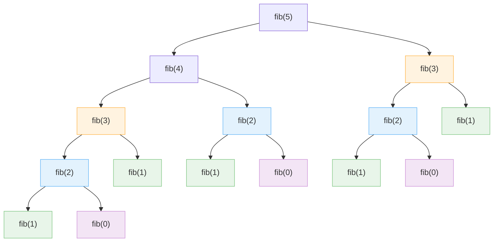

---
# 포스트 제목
title: "[Algorithms] 1-1: 효율적인 알고리즘이란?"

# 포스트 생성 시간
date: 2025-06-23 20:11:00 +09:00

# 포스트 최종 수정 시간
last_modified_at: 2025-08-09 17:30:00 +09:00

# 카테고리: [상위, 하위] 형식
categories: [Academics, Algorithms]

# 태그: 소문자로, 쉼표로 구분
tags: [algorithm, efficiency, time complexity, sequential search, binary search, fibonacci]

# 포스트 요약 설명 (검색엔진 및 소셜 공유 시 표시됨)
description: "알고리즘의 효율성이 왜 중요한지에 대해 알아봅니다."

# 썸네일 이미지 설정
image:
  # path: 
  # alt: # 썸네일 이미지 로드 전 이미지 대체 텍스트
  # lqip: # 저해상도 썸네일 이미지 경로

# --- 기능 활성화 여부 ---
toc: true      # 우측에 목차 표시
comments: true # 하단에 댓글창 표시
pin: false     # 메인 페이지에 고정
math: true    # 수학 수식(LaTeX) 렌더링 활성화 (필요시 true로 변경)
mermaid: true # Mermaid 다이어그램 렌더링 활성화 (필요시 true로 변경)
---

> 본 포스팅은 학부 '알고리즘' 강의에서 배운 내용을 바탕으로 재구성하여 정리한 글입니다.  
> 내용에 오류 혹은 오탈자가 있다면 댓글로 알려주시면 감사하겠습니다.

알고리즘의 효율성은 왜 중요할까요?  
똑같은 문제를 해결하더라도 어떤 알고리즘을 사용하느냐에 따라 그 성능에 차이가 존재합니다.  

이번 포스트에서는 알고리즘의 기본적인 정의부터 시작해, 몇 가지 구체적인 예시를 통해 효율적인 알고리즘을 설계하는 것이 왜 중요한지 알아보겠습니다.

---

# 1. Definition of Algorithms

알고리즘이란 무엇일까요?

결론부터 말하면, <u>알고리즘이란 Problem Instance를 해결하기 위한 Step-by-Step 절차</u>라고 할 수 있습니다.

이 문장을 제대로 이해하기 위해 몇 가지 용어들의 정의를 살펴보겠습니다:

-   **문제 (Problem)**
    -   우리가 답을 구하고자 하는, 변수가 포함된 일반적인 질문(question)을 의미합니다.
    -   *Ex. "주어진 `n`개의 수로 이루어진 리스트 `S`에서 특정 숫자 `x`가 포함되어 있는지 확인하시오."*

-   **문제 인스턴스 (Problem Instance)**
    -   문제의 각 변수(variable)에 구체적인 값이 할당된 상태.
    -   즉, 문제의 구체적인 사례(case)를 의미합니다.
    - 한 개의 Problem에 수많은 Problem Instance가 존재합니다.
    -   *Ex. "주어진 리스트 `S = [22, 5, 11, 41, 19, 28]`에서 `x = 19`가 포함되어 있는지 확인하시오."*

-   **알고리즘 (Algorithm)**
    -   주어진 Problem Instance를 해결하기 위한, 명확하게 정의된 단계별 절차(Step-by-Step Procedure)입니다.
    - 같은 Problem Instance라도 이를 해결하는 여러가지 Algorithm이 존재합니다.
    -   *Ex. 위 Problem Instance를 해결하기 위해 'Sequential Search Algorithm'을 사용한다.*

---

## 1.1 Efficiency of Algorithms

위에서 정의한 Problem, Problem Instance 그리고 Algorithm의 관계를 이해한다면, 왜 알고리즘에서 '**효율성(Efficiency)**'이 중요한지 알 수 있습니다.

다음의 문장이 주어졌다고 가정합니다:

> *Q. "A에서 B까지 가는 길을 찾아라."*

위 문장은 곧 Problem이 되고, 변수 A와 B에 특정 값이 할당된 문장이 곧 Problem Instance가 될 것입니다.

위 '길 찾기' 문제에 대한 Algorithm은 다음과 같이 있을 수 있습니다:

-   **알고리즘 A (최단 시간 우선)**
-   **알고리즘 B (최소 비용 우선)**
-   **알고리즘 C (최단 거리 우선)**

위 세 가지 알고리즘 중, 어느 것이 더 효율적인지는 '상황'과 '목표'에 따라 달라집니다.

알고리즘 A는 시간이 중요한 사람이, 알고리즘 B는 비용이 중요한 사람이 선택할 것입니다.

결론적으로,  
단순히 '작동하는' 알고리즘을 넘어, 주어진 상황에서 **최선의 결과를 내는 '효율적인' 알고리즘을 선택하고 설계**할 수 있어야 합니다.

---

# 2. Efficiency of Time

Computer Science 분야에서 알고리즘의 효율성을 따질 때, 가장 보편적이고 중요한 척도는 '**시간(Running Time)**' 입니다.

이 '시간'이라는 자원을 얼마나 효율적으로 사용하는지를 기준으로, 몇 개의 알고리즘들을 비교 분석해 보겠습니다.

---

## 2.1 Search Algorithms

가장 기본적인 알고리즘 문제 중 하나는 '탐색(Search)' 문제입니다.

이 탐색 문제를 해결하는 대표적인 두 가지 알고리즘을 보겠습니다.

> **Search Problem이란?**
> 
> 주어진 Data set(Ex. Array)에서 특정 값(Target)을 찾는 과정.
{: .prompt-info}

---

### 2.1.1 Sequential Search

**순차 탐색(Sequential Search)**은 리스트 내 첫 번째 원소부터 마지막 원소까지 하나씩 '순서대로' 탐색하는 방식입니다.

```java
public static int SequentialSearch (int listSize, int[] dataList, int target) {
    int location = 0; // 배열 인덱스는 0부터 시작한다고 가정
    while (location < listSize && dataList[location] != target) {
        location++;
    }

    if (location >= listSize) {
        return -1; // 찾지 못했을 경우
    } else {
        return location;
    }
}
```

- **Input**
	- `listSize`: 리스트의 길이. (양의 정수 `> 0`)
	- `dataList`: 값을 포함하는 리스트.
	- `target`: 찾고자 하는 특정 값.
- **Output**
	- `location`: `target`의 위치.
	- 만약 `dataList`에 `target`이 없다면 `-1`을 반환.

---

### 2.1.2 Binary Search

**이진 탐색(Binary Search)**은 정렬된 리스트를 절반씩 나눠 탐색 범위를 좁혀가며 탐색하는 방식입니다.

'정렬된 리스트'를 사용하므로, 이진 탐색은 순차 탐색과 달리 다음의 전제 조건이 필요합니다:

> **전제 조건**
> 
> 입력 리스트는 반드시 <u>일관된 순서로 정렬(sorted)</u>되어 있어야 합니다.
> 
> 일반적으로 오름차순(non-decreasing order)으로 졍렬하지만,  
> 내림차순으로 정렬된 경우에도 비교 로직만 반대로 구현하면 동일하게 적용 가능합니다.
{: .prompt-warning}


```java
public static int BinarySearch(int listSize, int[] sortedData, int target) {
    int low = 0;
    int high = listSize - 1;
    
    while (low <= high) {
        int mid = (low + high) / 2;
        if (target == sortedData[mid]) {
            return mid; // 값을 찾으면 해당 위치 반환
        } else if (target < sortedData[mid]) {
            high = mid - 1;
        } else {
            low = mid + 1;
        }
    }
    return -1; // 찾지 못했을 경우
}
```

- **Input**
	- `listSize`: 리스트의 길이. (양의 정수 `> 0`)
	- `sortedData`: 정렬된 리스트.
	- `target`: 찾고자 하는 특정 값.
- **Output**
	- `target`의 위치 값.
	- 만약 `sortedData`에 `target`이 없으면 `-1`을 반환.

---

### 2.1.3 Worst-Case Comparison

앞서 살펴본 두 탐색 알고리즘의 효율성은 특정 상황에서 차이를 보입니다.

알고리즘의 성능을 객관적으로 비교하기 위해, 일반적으로 **최악의 경우(Worst-Case)**에서의 성능을 기준으로 삼습니다.

> **최악의 경우 (Worst-Case)**
> 
> 최대 연산 횟수를 유발하는 입력을 의미합니다.
> 
{: .prompt-info}

두 알고리즘에서의 Worst-Case는 다음과 같습니다:
- **Sequential Search**
	- 찾고자 하는 값이 배열에 존재하지 않음.
	- 찾고자 하는 값이 배열의 맨 마지막에 위치.
- **Binary Search**
	- 찾고자 하는 값이 배열에 존재하지 않음.
	- 찾고자 하는 값이 더 이상 나눌 수 없을 때까지 반으로 쪼개야 하는 곳에 위치.

최악의 경우(worst case) 필요한 비교 횟수는 다음과 같습니다:

| Array Size               | Sequential Search | Binary Search |
| :----------------------- | :---------------- | :------------ |
| $128 (2^7)$              | $128$             | 약 $8$         |
| $1,024 (2^{10})$         | $1,024$           | 약 $11$        |
| $1,048,576 (2^{20})$     | $1,048,576$       | 약 $21$        |
| $4,294,967,296 (2^{32})$ | $4,294,967,296$   | 약 $33$        |

위 표에서, 이진 탐색의 비교 횟수는 $\text{지수 크기} + 1$ 정도의 규칙성을 보입니다.

즉, 배열 크기 $n$이 $2^k$일 때, 비교 횟수는 약 $k+1$번에 해당한다고 볼 수 있습니다.

> **이진 탐색의 로그 시간(Logarithmic Time)**
> 
> - 이진 탐색의 동작 방식은 <u>현재 탐색 범위의 절반씩 줄여가며</u> 진행됩니다.
> - 만약 배열 크기가 2의 거듭제곱 형태 $2^k$라고 한다면, 절반씩 줄일 때마다 $2^1$씩 줄어들게 됩니다.
> - 따라서, 이진 탐색의 Worst-Case에서의 비교 횟수는 $k+1$ 정도입니다.
> - 이는 $\log_{2}n$에 가까운 수치입니다.
> 
> 결과적으로,  
> 이진 탐색은 <u>데이터가 2배로 늘어나도, 검색 단계는 딱 한 번만 더 거치면 되는 효율성</u>을 보여줍니다.
{: .prompt-tip}


---

## 2.2 Fibonacci Sequence

피보나치 수열을 구현하는 방식에 따라서도 알고리즘의 효율성을 비교할 수 있습니다.

피보나치 수열의 점화식(recurrence relation)은 다음과 같습니다:

$$
f_n =
\begin{cases}
  0 & \text{if } n = 0 \\
  1 & \text{if } n = 1 \\
  f_{n-1} + f_{n-2} & \text{if } n > 1
\end{cases}
$$


피보나치 수열의 점화식은 주로 다음의 두 가지 방식으로 구현됩니다:
- **재귀(Recursion)**
- **반복(Iteration)**

---

### 2.2.1 Recursive Fibonacci

점화식을 가장 직관적인 구현하는 방식은 재귀를 사용하는 것입니다.

```java
public static int fib_recursive(int n) {
    if (n <= 1) {
        return n; // 재귀의 탈출 조건 (Base Case)
    } else {
        return fib_recursive(n - 1) + fib_recursive(n - 2);
    }
}
```

- **Input**
	- `n`: $0$보다 크거나 같은 정수. (`n >= 0`)
- **Output**
	- 피보나치 수열의 `n`번째 항의 값.


이 코드는 간결하면서도 직관적이지만, `fib(5)`를 호출하는 과정을 재귀 호출 트리 형태로 살펴보면 비효율성을 발견할 수 있습니다.



트리를 보면, <u>동일한 계산이 중복</u>되어 나타나는 것을 볼 수 있습니다:
- `fib(3)`(노란색 노드)는 2번 호출.
- `fib(2)`(파란색 노드)는 3번 호출.
- `fib(1)`(초록색 노드)는 5번 호출.
- `fib(0)`(빨간색 노드)는 3번 호출.


이러한 중복 계산은 입력 $n$이 커질수록 급격하게 증가하게 됩니다.

---

#### [Calculate Time Complexity]

Recursive Fibonacci Sequence의 시간 복잡도는 어떻게 되는지 수학적으로 증명합니다.

---

**<u>관계식 및 부등식 설정</u>**

Let $T(n)$ is 트리의 노드 개수. (재귀 호출 횟수)

Assume that $n$ is even. (계산의 편의를 위해)
 
 - 피보나치 함수 `fib(n)`은 `fib(n-1)`과 `fib(n-2)`를 호출하므로, $T(n)$은 다음의 관계식을 가집니다:
   
   $$T(n)=T(n-1)+T(n-2)$$
 
- 여기서 $T(n-1)$의 재귀 호출 횟수는 $T(n-2)$보다는 항상 큽니다:
  
  $$T(n-1)>T(n-2)$$
- 따라서 $T(n-2)$의 두 배보다도 $T(n-1)+T(n-2)$가 더 클 것임이 자명합니다:
  
  $$T(n-1)+T(n-2) > 2 \cdot T(n-2)$$
 
 - 여기서 좌변의 $T(n-1)+T(n-2)$은 $T(n)$이므로, 다음의 부등식이 성립하게 됩니다:
   
   $$T(n) > 2 \times T(n-2)$$

---

**<u>부등식 확장 및 일반화</u>**

- 부등식 $T(n)>2 \times T(n-2)$에서, $T(n-2)$는 $T(n-3)+T(n-4)$이고,  
  다시 $T(n-3)+T(n-4)$는 $T(n-2)>2 \times T(n-4)$이므로, 다음의 부등식이 성립합니다:
  
  $$
T(n)> 2 \times 2 \times T(n-4)
$$

- 부등식을 전개함에 따라 다음과 같은 패턴이 나타납니다.
	- **1번 전개:** $T(n)> 2^1 \times T(n-(2 \times 1))$
	- **2번 전개:** $T(n)> 2^2 \times T(n-(2 \times 2))$
	- **3번 전개:** $T(n)> 2^3 \times T(n-(2 \times 3))$

 - 즉, 다음과 같이 나타낼 수 있습니다:

$$\begin{align*} T(n) &> 2 \times T(n-2) \\ &> 2 \times 2 \times T(n-4) \\ &>2 \times 2 \times 2 \times T(n-6) \\ &> \dots \\ &> 2 \times 2 \times \dots \times 2 \times T(0)\end{align*}$$


---

**<u>일반화</u>**

Let 부등식 전개 횟수 $= k$

- 전개를 $k$번 반복했을 때의 일반식은 다음과 같이 쓸 수 있습니다:
  
  $$T(n)>2^k \times T(n-2k)$$
  
- 이 재귀 호출은 $T(\dots)$ 안의 값이 기저 사례(Base Case)에 도달했을 때 멈추게 됩니다.
- 가정 "$n$ is even"에 따라, Base case는 $T(0)$에 해당합니다.
- 따라서 다음의 식이 성립됩니다:
  
  $$n-2k=0$$

- 이 식을 $k$에 대해 풀어보면:
  
  $$
\begin{align*}
2k=n \\
\therefore k=\frac{n}{2}
\end{align*}
$$


- 이제 위 일반식에서 $k$에 $n/2$를 대입합니다:
  
  $$
\begin{align*}
&T(n) > 2^{n/2} \times T\left( n - 2 \cdot \left( \frac{n}{2} \right) \right) \\
\therefore \; &T(n)>2^{n/2} \times T(0)
\end{align*}
$$

---

**<u>결론</u>**

- $T(0)$은 `fib(0)`을 호출하는 것으로, 단 1번의 연산만 필요하므로 상수에 해당합니다.
- 따라서, 이 상수를 무시하고 증가 추세만 보면, 다음의 결론에 도달합니다:
  
  $$\therefore T(n)> 2^{n/2}$$


> 최종적으로, 재귀 호출 횟수 $T(n)$은 최소 $2^{n/2}$보다 빠르게 증가한다는 것을 수학적으로 증명할 수 있습니다.
> 
> 이는 **최악의 경우 $O(2^n)$의 지수시간(Exponential Time)이 걸리는 비효율적인 알고리즘임을 의미합니다.**


> **"재귀는 효율성을 보장해주지는 않는다."**
> 
> 재귀(recursion)라는 방식은, 단순히 내 생각을 효과적으로 표현할 수 있게 해주는 <u>도구</u> 중 하나입니다.  
> 모든 도구가 항상 효율적이지는 않듯이, 재귀가 효율성을 보장해주지는 않습니다.
{: .prompt-warning}

---

### 2.2.2 Iterative Fibnacci

반복문을 사용하면 **중복 계산 없이** 피보나치 수를 효율적으로 구할 수 있습니다.

가장 작은 문제부터 차례대로 답을 구해 배열에 저장해두고, 더 큰 문제를 풀 때 그 <u>결과를 재사용하는 방식으로 구현</u>됩니다. (이러한 기법을 **동적 계획법(Dynamic Programming)**이라고 합니다)


```java
public static int fib_iterative(int n) {
    if (n <= 1) return n;

    int[] fib_array = new int[n + 1];
    fib_array[0] = 0;
    fib_array[1] = 1;

    for (int i = 2; i <= n; i++) {
        fib_array[i] = fib_array[i - 1] + fib_array[i - 2];
    }
    return fib_array[n];
}
```

- **Input**
	- `n`: $0$보다 크거나 같은 정수. (`n >= 0`)
- **Output**
	- 피보나치 수열의 `n`번째 항의 값.


위 의사코드에서 모든 연산을 고려한 반복 횟수 $T(n)$을 계산해보겠습니다:
- `fib_array[0] = 0`: $1$번 실행 $O(1)$
- `fib_array[1] = 1`($n>0$일 경우): $1$번 실행 $O(1)$
- `for` 루프: $(n-1)$번 실행 $O(n)$

따라서,

$$
\begin{align*}
T(n)&= 1+ 1+(n-1) \\
&= n+1
\end{align*}
$$

즉, 최대 $T(n)=n+1$번의 연산이 수행됩니다.

> 결론적으로, 연산 횟수는 입력 $n$에 정비례하며, 시간 복잡도는 **$O(n)$** 입니다.
> 
> 이는 Resursive 구현 방식의 시간 복잡도 $O(2^n)$과 비교하여 매우 효율적인 방식입니다.

---

# Summary

-   하나의 **문제(Problem)**는 여러 구체적인 **사례(Problem Instance)**로 나뉠 수 있으며, 각 사례는 다양한 **알고리즘(Algorithm)**으로 해결될 수 있습니다.
-   알고리즘의 **효율성**은 다양한 척도로 평가할 수 있으며, 컴퓨터 과학에서는 주로 **실행 시간(Running Time)**을 객관적인 기준으로 삼습니다.
-   **탐색 문제(Search Problem)**: 데이터가 **정렬**되어 있다는 전제 하나만으로, 시간 복잡도를 $O(n)$에서 $O(\log n)$으로 개선할 수 있었습니다.
-   **피보나치 문제(Fibonacci Problem)**: **중복 계산**을 제거함으로써, $O(2^n)$의 비효율적인 알고리즘을 $O(n)$의 효율적인 알고리즘으로 바꿀 수 있었습니다.


---

# References

본 포스팅은 학부 '알고리즘' 강의에서 학습한 내용을 기반으로 작성되었습니다.  
해당 강의 계획서에 명시된 교재 정보는 다음과 같습니다:

-   **주교재 (Main Textbook)**
    -   Neapolitan, R., & Naimipour, K. (2004). *Foundations of Algorithms Using Java Pseudocode*. Jones & Bartlett Publishers.

-   **참고 교재 (Supplementary Textbook)**
    -   Cormen, T. H., Leiserson, C. E., Rivest, R. L., & Stein, C. (2022). *Introduction to Algorithms (4th ed.)*. The MIT Press.