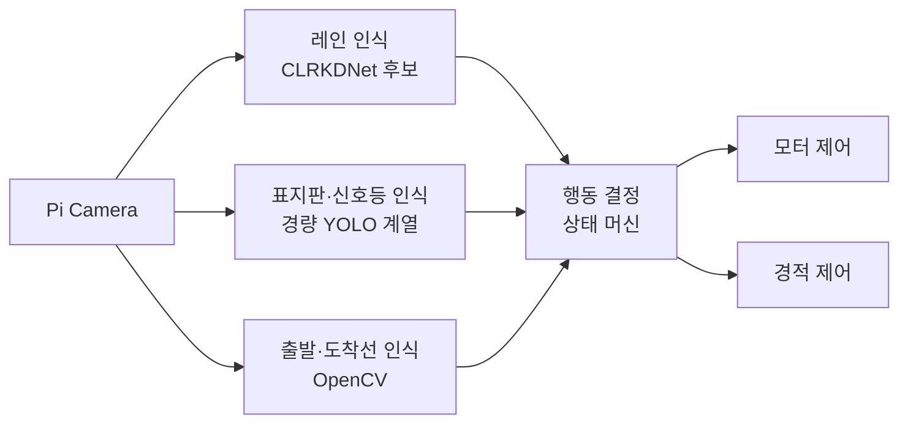

## 들어가며

[[Log 01_개발환경 세팅하기|지난 포스팅]]에서는 자동차를 조립하고 Raspberry Pi 5에 원격으로 접속할 수 있는 개발환경을 구성했다. 이제 카메라로 맵을 보면서 자동차가 스스로 주행하도록 만들어야 한다.

난 문제를 풀려면 그 문제가 뭔지부터 확실하게 이해하는 걸 좋아한다. 잘 모른 채로 내가 뭘 하는 지도 이해하지 못한 채로 시작하는 걸 별로 안 좋아하는 것 같다. 이 프로젝트도 마찬가지로 무슨 task인지 파악부터 해보자. 내가 뭘 해야 할지를 그래야 알고 시작할 수 있다.

처음에는 자율주행이라는 task 자체가 좀 막연하게 느껴지긴 했는데, 자동차가 해야 할 일을 하나씩 나누어 생각해보니까 서로 성격이 다른 문제들로 구성되어 있음을 알았다.

이번 글에서는 프로젝트의 요구사항을 정리하고, 이를 어떤 인식 모듈과 제어 구조로 풀어갈지 전체 아키텍처를 설계해보려 한다.

---

## 1. 자동차가 해야 하는 일

프로젝트의 목표는 Raspberry Pi 5 자동차가 약 2m × 2m 크기의 맵을 자율주행하여 다시 출발 지점으로 돌아오는 것이다.

![[map2.png|500]]
> 프로젝트에서 사용하는 주행 맵. 자동차는 노란 두 선 사이를 따라가며 표지판과 신호등의 지시를 수행해야 한다.

주행 중 수행해야 하는 일은 크게 세 가지다.

1. 노란 두 선 사이의 도로를 벗어나지 않고 주행한다.
2. 표지판과 신호등을 인식하고 정지·회전·감속·경적 같은 행동을 수행한다.
3. 주행을 마친 뒤 빨간 가로선으로 표시된 도착 영역 안에 정지한다.

맵에서 실제로 사용하는 표지판과 신호등은 다음과 같다:

|                  좌회전                  |                   직진                   |                     우회전                     |                 정지                 |
| :-----------------------------------: | :------------------------------------: | :-----------------------------------------: | :--------------------------------: |
|  ![[embedded_ai_car_left.jpg\|180]]   | ![[embedded_ai_car_straight.jpg\|180]] |     ![[embedded_ai_car_right.jpg\|180]]     | ![[embedded_ai_car_stop.jpg\|180]] |
|                  감속                   |                   경적                   |                     신호등                     |                                    |
| ![[embedded_ai_car_speed20.jpg\|180]] |   ![[embedded_ai_car_horn.jpg\|180]]   | ![[embedded_ai_car_traffic_light.jpg\|180]] |                                    |

출발선과 도착선은 별도의 객체 클래스가 아니다. 두 지점 모두 빨간 가로선으로 표시되므로, 자동차의 현재 주행 상태와 함께 판단해야 한다.

---

## 2. 인식 문제를 나누어 보기

카메라 영상을 하나의 모델에 넣고 조향값까지 바로 얻는 End-to-End 방식도 고려했었지만, 맵에서 필요한 정보들을 정리해보면 모두 같은 방식으로 처리하기에는 성격이 달랐다.

먼저, **레인 정보**는 주행하는 동안 계속 확인해야 한다.
자동차가 도로의 어느 위치에 있고 어느 방향으로 향하고 있는지를 매 프레임 추정해야 하기 때문이다.

**표지판과 신호등**은 특정 위치에서 잠깐 나타난다.
이 경우에는 정확한 도로 geometry보다 어떤 대상이 보였고, 언제 행동을 시작해야 하는지가 중요하다.

마지막으로 **빨간 출발·도착선**은 같은 형태를 공유한다.
카메라에 빨간선이 보였다는 이유만으로 정지하면 출발하자마자 멈출 수 있으므로, 주행 시작과 종료 상태를 구분해야 한다.

이에 따라, 전체 문제를 다음 세 종류로 나누었다.

- **레인 인식:** 연속적인 주행 방향 추정
- **표지판·신호등 인식:** 특정 위치에서 발생하는 행동 이벤트 생성
- **출발·도착선 인식:** 주행 상태와 함께 처리하는 종료 이벤트 생성

각 인식 결과는 곧바로 모터를 움직이지 않고, 행동 결정 모듈에서 함께 해석하도록 계획했다.
이렇게 하면 한 모듈을 수정하더라도 전체 시스템을 다시 학습할 필요가 없고, 나중에 실제 주행에서 문제가 생겼을 때 원인을 나누어 확인하기도 쉬울 것이다.

---

## 3. 각 모듈의 방향 정하기

### 3.1. 레인 인식

==초기 레인 모델 탐색 기준==

레인은 자동차가 주행하는 내내 사용해야 하므로, 전체 시스템에서 가장 중요한 인식 모듈이다.
근데 또 그렇다고 레인 모델 성능에 집중하기엔 프로젝트 기간이 긴 것은 아니라서, 비교적 최근에 공개됐고 성능이 검증된 모델을 가져와 우리 맵에 맞게 fine-tuning하는 전략을 세웠다.

레인 모델을 찾을 때는 다음 조건들을 먼저 봤다:

- 비교적 최근에 공개됐고 lane detection benchmark에서 충분한 성능을 보였는가
- 학습 코드와 pretrained checkpoint가 공개되어 있는가
- Raspberry Pi에 올려볼 수 있을 만큼 가볍거나, 경량화를 고려한 모델인가
- 우리 맵에서 수집한 데이터로 fine-tuning할 수 있는가

이 조건을 기준으로 공개된 레인 모델 후보를 좁혀갔고, 초기 모델로 선택한 것이 CLRKDNet이었다.

==CLRNet을 경량화한 CLRKDNet==

[CLRNet](https://openaccess.thecvf.com/content/CVPR2022/html/Zheng_CLRNet_Cross_Layer_Refinement_Network_for_Lane_Detection_CVPR_2022_paper.html)의 CLR은 **Cross Layer Refinement**의 약자다. 먼저 고수준 feature에서 도로의 전체적인 문맥을 보고 레인이 있을 위치를 대략 찾은 뒤, 더 세밀한 저수준 feature를 이용해 레인 후보의 위치를 여러 단계에 걸쳐 보정한다.

[CLRKDNet](https://arxiv.org/abs/2405.12503)은 이 CLRNet을 더 가볍게 만든 모델이다. 뒤의 KD는 **Knowledge Distillation**을 뜻한다. CLRNet에서 여러 번 수행하던 feature 결합과 refinement 과정을 단순화하고, 그 과정에서 줄어들 수 있는 성능은 무거운 CLRNet을 teacher로 두고 학습하며 보완한다. 실제 추론에서는 teacher 없이 가벼운 student model만 실행한다.

![[report_ch03_f03-02_clrkdnet_fps_f1.png]]
> CLRKDNet 논문에서 비교한 CULane F1과 FPS. CLRKDNet은 비슷한 정확도 구간의 모델 가운데 속도와 정확도의 균형이 좋은 편이었다. 단, FPS는 RTX 3090에서 측정한 값이므로 Pi 성능과는 별개다.
> ref: CLRKDNet, Fig. 1.

논문의 GPU 수치가 Raspberry Pi에서의 속도를 보장하는 것은 아니지만, 정확도만 높은 모델보다 속도와의 균형을 고려한 구조라는 점은 이 프로젝트와 잘 어울리는 모델이라고 생각했다. [공식 repository](https://github.com/weiqingq/CLRKDNet)에 학습·평가 코드와 CULane pretrained weight가 공개되어 있어, 모델을 처음부터 학습하기보다 이미 Knowledge Distillation을 마친 ResNet-18 student에서 시작할 수도 있었다.

아무튼 이 모델을 우리 맵 데이터로 fine-tuning하고, 이후 ONNX 변환과 양자화를 거쳐 Pi에 올려보는 방향을 잡았다.

==레인 후보에서 조향값까지==

CLRKDNet을 선택한 뒤 공식 구현과 출력 형식을 살펴보니, 이 모델은 조향값을 바로 예측하는 주행 모델이 아니었다. 이미지에 레인이 있을 법한 여러 **lane prior**를 두고, 각 후보의 신뢰도와 위치·방향·길이 같은 geometry를 예측하는 lane detection model이다.

모델의 출력은 decoder를 거쳐 이미지 위의 레인 곡선 후보로 복원된다. 따라서 프로젝트에서는 이 후보 중 주행에 사용할 레인을 고르고, 좌·우 레인 사이의 주행 기준을 계산해 조향값으로 바꾸는 과정을 모델 뒤의 후처리로 분리하기로 했다.

```text
Camera frame
→ CLRKDNet
→ Lane candidate
→ Decoder
→ Image-space lane curve
→ Driving postprocess
→ Steering
```

이렇게 두면 레인 모델은 카메라에서 **주행에 필요한 geometry를 찾는 역할**에 집중하고, 어떤 레인을 선택해 얼마나 회전할지는 별도의 주행 로직에서 조정할 수 있다. 모델을 다시 학습하지 않고도 후보 선택이나 조향 규칙을 바꿀 수 있고, 실제 주행에서 문제가 생겼을 때 모델과 제어 중 어느 쪽의 문제인지 나누어 확인하기도 쉽다.

다만 공개 weight는 실제 도로 영상인 CULane으로 학습됐고, 공식 실행 환경도 GPU를 기준으로 한다. 우선 CLRKDNet을 초기 레인 모델로 정하되, Pi에서 실행할 수 있는지와 작은 실내 맵의 노란 레인에도 유효한 출력을 내는지는 직접 확인해야 했다.

### 3.2. 표지판과 신호등 인식

레인 모듈이 매 frame의 연속적인 geometry를 제공한다면, 표지판과 신호등은 특정 순간에 행동 event를 만드는 문제다. 화면 안에서 위치를 함께 찾아야 하므로 객체 탐지 문제로 두었다. 모델 버전을 처음부터 고정하기보다는 Raspberry Pi에서도 실행 가능한 경량 YOLO 계열을 기준으로 데이터셋과 추론 파이프라인을 구성하기로 했다.

인식할 클래스와 각 클래스가 의미하는 행동은 다음과 같이 정리했다:

| 구분 | 클래스 | 자동차의 행동 |
|---|---|---|
| 방향 표지판 | `left`, `right`, `straight` | 교차로에서 지정된 방향으로 진행 |
| 정지 표지판 | `stop` | 일정 시간 정지 |
| 경적 표지판 | `horn` | 경적을 한 번 울림 |
| 감속 표지판 | `speed_20` | 일정 구간 감속 |
| 신호등 | `green` | 정지하지 않고 우회전 |
| 신호등 | `red` | 3초간 정지한 뒤 우회전 |

객체 탐지 모델은 클래스와 위치를 출력하고, 실제 회전이나 정지를 언제 실행할지는 별도의 행동 결정 로직이 담당하도록 했다.

### 3.3. 출발·도착선 인식

빨간 출발·도착선은 화면 아래쪽에 넓은 가로 형태로 나타나는 비교적 단순한 대상이다. 별도 학습 모델을 추가하기보다 OpenCV의 색상 마스크와 contour 조건으로 처리하는 방향을 잡았다.

---

## 4. 전체 아키텍처

전체 시스템은 카메라 프레임을 세 인식 모듈에서 처리한 뒤, 행동 결정 모듈이 결과를 모아 모터와 경적을 제어하는 구조로 설계했다.

다이어그램으로 보면 아래와 같이 설계도가 그려진다:



- 레인 모듈은 연속적인 주행 방향을 제공한다.
- 표지판과 신호등 모듈은 특정 행동 이벤트를 만든다.
- 도착선 모듈은 주행 종료 시점을 알린다.
- 행동 결정 모듈은 이 결과들의 우선순위와 현재 상태를 확인하여 최종 명령을 선택한다.

세 모듈은 필요한 실행 주기와 판단 기준이 서로 다르다. 인식과 행동을 분리하면 실제 맵에서 문제가 생겼을 때 각 모듈을 독립적으로 검증하고 수정할 수 있다고 판단했다.

---

## 마치며

이렇게 자율주행 과제를 레인 인식, 표지판·신호등 인식, 출발·도착선 인식으로 나누고, 각 결과를 상태 머신에서 조합하는 전체 구조를 설계했다.

실험을 해보기도 전이라, 너무 디테일하게 아키텍처를 설계하지는 않았다. 사실 레인 모델을 이런 식으로 저렇게 특정한 모델 하나로 정하는 게 맞나 싶은 생각이 들기는 한다. 설계해놓고 보니 저 레인모델이 사실상 제일 비중있고 중요한 부분 같은데... 저 레퍼런스 모델이 만약 안되면 갈아엎어야 할 수도 있을 것 같다.

다른 Sign 탐지 event야 사실 YOLO 계열 사용하면 크게 문제 없을 것 같아서...

그래서 다음부턴 이 레인 모델부터 집중적으로 검증과 실험을 들어가지 않을까 싶다.
다음 주는 중간고사 기간이라 아마 다음 작업은 1주 이상 지나서야 진행하지 않을 듯 싶다.

---

## References

- [CLRNet: Cross Layer Refinement Network for Lane Detection, CVPR 2022](https://openaccess.thecvf.com/content/CVPR2022/html/Zheng_CLRNet_Cross_Layer_Refinement_Network_for_Lane_Detection_CVPR_2022_paper.html)
- [CLRNet GitHub](https://github.com/Turoad/CLRNet)
- [CLRKDNet: Speeding up Lane Detection with Knowledge Distillation](https://arxiv.org/abs/2405.12503)
- [CLRKDNet GitHub](https://github.com/weiqingq/CLRKDNet)
- [Ultralytics YOLO Documentation](https://docs.ultralytics.com/)
