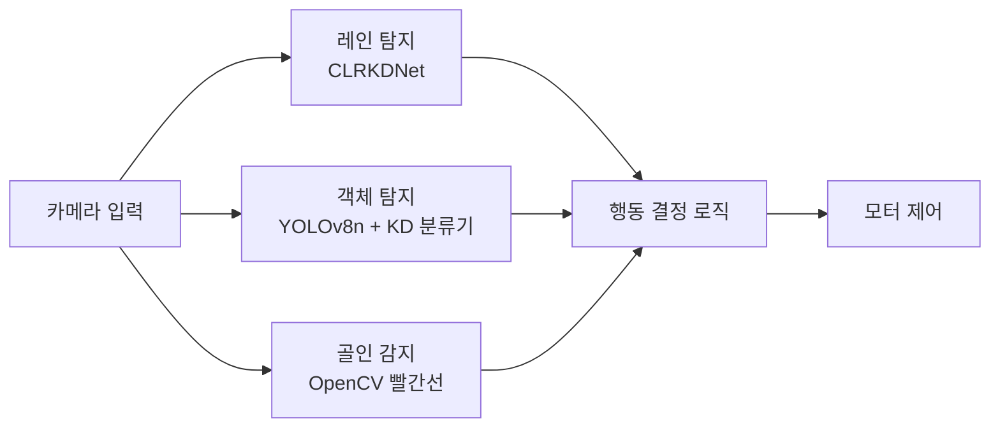

[[Log 01_개발환경 세팅하기|지난 포스팅]]에서 라즈베리파이 개발환경을 구성했다.

이번엔 프로젝트가 대충 어떻게 진행되고, 이 프로젝트와 AI가 어떻게 연결되는지, 자율주행 자동차 학습과 추론은 어떻게 해야 하는지 파악하면서 아키텍처 설계를 진행해 보겠다.

---

## 프로젝트가 요구하는 것

이번 프로젝트에서 라즈베리파이 5 보드 자율주행 자동차는 맵 위에서 세 가지를 동시에 수행해야 한다.

1. 노란 두 선 사이 도로를 이탈 없이 주행
2. 표지판·신호등 규칙에 맞게 동작 (정지, 방향 전환, 감속, 경적 등)
3. 골인 지점의 빨간선 두 개 사이에 정차

![[map2.png|500]]
> 프로젝트 맵. 노란 도로, 표지판·신호등, 골인 빨간선이 배치된다.

아키텍처는 이 세 task를 각각 독립된 모듈로 해결하고, 행동 결정 로직이 그 결과를 조합해 최종 모터 명령을 내리는 구조로 설계했다.

모듈을 고를 때 단순히 "가장 정확한 모델"을 기준으로 삼진 않았고, 다음과 같은 조건들을 고려해야 했다:
- Pi 5의 연산 성능
- 내 Pi에 꽂힌 SD 카드 용량 (16GB)
- 주행 중 허용되는 추론 지연시간(Latency)

이런 것들을 고려했을 때, Knowledge Distillation이나 Pruning, QAT처럼 경량화 기법을 적용할 여지가 있는 구조를 우선 고려했다.

그리고 프로젝트 시간이 많지는 않았기에, 데이터 수집 문제나 모델 구현(오픈소스가 공개되어 있는지) 등도 고려해야 했다.

이제 각 모듈을 어떻게 선택했고, 어떻게 조합했는지 순서대로 정리한다.

---

## 1. 레인 모델 선택

### 후보 비교하기

레인 주행을 인식 문제로 풀려면 모델이 뭘 입력받아서 뭘 내놓아야 하는지부터 정해야 한다.
이미지 input을 받아서 조향각을 바로 내놓을지, 선의 좌표를 뽑을지, 픽셀 단위로 분할할지 등 여러 갈래다.

출력 형태 자체가 다양해서 방향별로 후보를 탐색하고 비교해 봤다.

| 방식                  | 검토 결과                                                           |
| ------------------- | --------------------------------------------------------------- |
| OpenCV HSV + 규칙 기반  | 선 색상 마스킹으로 편차 계산. 조명·노이즈에 취약하고 CNN 수준의 강건성이 없음.                 |
| End-to-End CNN (회귀) | 이미지 → 조향각을 직접 매핑. 선 위치를 명시적으로 파악하지 않는 블랙박스라 교차로에서 방향 판단 근거가 약함. |
| ENet (Segmentation) | 픽셀 단위 레인 분할. 정확하지만 pixel-wise 레이블 자동화가 어렵고 추론 속도가 느림.           |
| UFLD (Row-Anchor)   | 각 행에서 선 위치 직접 예측. 빠르지만 교차로 처리 취약.                               |
| **Line Anchor 계열**  | **선택 → CLRKDNet**                                               |

결론부터 말하면 Line Anchor 계열의 CLRKDNet을 선택했다.

![[Pasted image 20260418122329.png|600]]
> Line Anchor 방식의 실제 출력 예시. 차선이 하나의 선 단위로 뽑혀 있다. 픽셀 segmentation이나 조향각 회귀와는 다른 결의 출력이다.
> (ref: Line-CNN, IEEE T-ITS 2020, Fig. 2)

### Line Anchor 계열이 맞는 이유

<u>**동작 방식**</u>
이미지 경계(왼쪽·오른쪽·아래)에서 직선 후보(ray)를 미리 뻗어놓고, 네트워크가 각 ray가 실제 차선일 확률과 offset을 예측하는 방식이다.

객체 탐지의 Region Proposal Network를 선 버전으로 재해석한 개념이라고 볼 수 있겠다.

![[Pasted image 20260418114757.png]]
> 객체 탐지의 RPN(좌, anchor box)을 선 단위로 옮긴 LPU(우, line proposal). Line Anchor는 이 아이디어에서 출발한다.
> (ref: Line-CNN, IEEE T-ITS 2020, Fig. 4)

이 방식을 선택한 이유는, 각 row에서 차선의 x좌표를 명시적으로 추출하기 때문이다.
왼쪽 선과 오른쪽 선의 x좌표를 알면 두 선 중간을 계산하여 도로 중앙을 파악할 수 있고, 차 위치가 중앙에서 얼마나 벗어났는지(편차)로 조향각을 낼 수 있다.
이렇게 되면 교차로에서도 "왼쪽 선을 따라갈지, 오른쪽 선을 따라갈지" 판단할 근거가 생긴다. 표에서 잠깐 언급했던 End-to-End CNN 회귀 방식이 이미지 → 조향각을 한 번에 매핑하는 블랙박스인 것과 대비되는 지점이다.

<u>**데이터 수집**</u>
Line Anchor의 레이블 포맷은 각 이미지마다, 차선별로 미리 정해둔 row들에서의 x좌표 sequence다.

![[Pasted image 20260418122438.png]]
> 왼쪽은 annotated 원본 이미지, 오른쪽은 차선을 "일정 간격 수평선 위 x좌표 sequence"로 표현한 모습. 각 row당 x값 하나. 이게 Line Anchor 레이블의 본질이다.
> (ref: Line-CNN, IEEE T-ITS 2020, Fig. 5)

이런 이미지 데이터 포맷이 프로젝트와 적합하다고 판단했는데, 크게 2가지 이유에서다:

1. **CULane pretrained weight가 공개**되어 있다.
	- CULane은 홍콩중문대에서 만든 약 13만 장짜리 대규모 차선 탐지 벤치마크(normal, crowded, night, no-line, shadow 등 9개 시나리오)다.
	- 이 스케일을 처음부터 만드는 건 불가능하지만, pretrained weight에 우리 맵에서 찍은 수백 장 규모 데이터를 Fine-tuning하는 방식으로 도메인을 옮길 수 있다.
2. **OpenCV로 레이블 자동 생성이 가능**하다.
	- 실제 도로 데이터는 수작업으로 점을 찍어야 했지만, 우리 맵은 배경이 깨끗하고 노란선 색이 균일한 모형 트랙이라 HSV로 노란선 픽셀을 뽑고 각 row에서 중심 x좌표를 계산하면 그대로 Line Anchor 레이블이 된다.
	- "데이터를 안 모아도 된다"가 아니라 양이 적어도 되고 그나마 자동화 가능하다.

<u>**모델 구현**</u>
모델 선정 기본 조건 중 하나는 "학습 코드와 pretrained weight가 공개되어 있는가"였다.
한 달 남짓한 기간 동안 논문만 보고 밑바닥부터 구현하는 건 현실적으로 불가능하기 때문에, 오픈소스 공개 여부가 중요했다.
Line Anchor 계열의 대표 모델들(CLRNet, CLRKDNet)은 모두 GitHub에 구현이 공개되어 있고 CULane pretrained weight도 함께 제공된다.

### 왜 CLRKDNet?

그래서 이 계열 안에서 세부 후보를 비교했다. Line Anchor 계열은 대략 다음과 같이 이어져 왔다.

- **Line-CNN** (2020, IEEE T-ITS). Line Proposal Unit(LPU)로 개념 시초.
- **CLRNet** (2022, CVPR). Cross Layer Refinement 방식. FPN 각 레벨에서 Lane Prior를 단계적으로 정교화. CULane F1 80.13%로 당시 SOTA.
- **CLRKDNet** (2024). CLRNet(ResNet101 Teacher)을 ResNet18 Student로 Knowledge Distillation해 경량화.

![[Pasted image 20260418134523.png|300]]
> 학습 데이터에 대한 CLR(Cross Layer Refinement)의 결과 예시. FPN의 상위 레이어에서 잡은 대략적인 lane prior를 하위 레이어를 거치며 단계적으로 정교하게 다듬는다.
> (ref: CLRNet, CVPR 2022, Fig. 6 마지막 컬럼)

Pi 5에 실시간 추론용으로 올리는 입장이라 정확도뿐 아니라 속도·용량이 중요했다.

![[Pasted image 20260418115613.png|500]]
> CULane에서의 FPS vs F1-score. CLRKDNet(노란 별)이 기존 모델들 대비 속도·정확도 trade-off의 우상단에 위치한다.
> (ref: CLRKDNet, 2024, Fig. 1)

CLRKDNet은 CLRNet 대비 추론 속도를 최대 60% 끌어올리면서 정확도는 거의 유지했다.
모델 크기도 ONNX 변환 후 약 30~50MB 수준이라 SD 카드 16GB 제약에도 여유가 있다.

---

## 2. 객체 탐지 모델 선택

이 프로젝트에서 객체 탐지가 필요한 대상은 도로 위 **표지판과 신호등**이다.
방향 표지판은 교차로에서 어느 쪽으로 갈지 정하고, 신호등은 정지·재출발 타이밍을 좌우한다.

![[Pasted image 20260418135643.png|300]]

![[Pasted image 20260418135704.png|300]]

![[Pasted image 20260418163604.png|300]]

> 맵에 배치되는 표지판 및 신호등 예시.

맵 위에서 이들은 프레임마다 계속 보이는 게 아니라, 특정 지점에서 잠깐 등장한다.
이 특성 때문에 "탐지와 분류를 한 모델이 같이 할지, 2단계로 나눌지"가 선택지였다.

### 단일 모델 vs 2단계 파이프라인

<u>**단일 모델 방식**</u>
- YOLOv8n이나 SSD처럼 탐지와 분류를 한 모델에서 처리한다.
- 항상 전체 이미지를 처리해야 해서, 표지판이 없는 프레임에도 불필요한 연산이 들어간다.
- 클래스를 추가할 때마다 탐지 모델 전체를 재학습해야 한다.

<u>**2단계 파이프라인**</u>
- 1단계에서 표지판이 있는지 찾고, 있을 때만 2단계에서 무슨 종류인지 분류한다.
- 표지판이 없는 경우 2단계를 아예 호출하지 않아서 연산량이 크게 줄어든다.

2단계 파이프라인으로 방향을 정했다.
맵은 프레임 대부분이 "표지판 없음" 상태다.
그래서 1단계가 "없음"을 빠르게 반환하면 분류기는 아예 호출되지 않고 끝나기 때문에, 단일 모델 대비 실질적인 연산량이 크게 줄어들 것이다.

### 1·2단계 모델 선택

<u>**1단계 (YOLOv8n)**</u>
표지판이 화면에 있는지, 그리고 어디에 있는지를 찾는다.
YOLOv8n의 경우, Ultralytics 공식 구현이 공개돼 있고 edge 추론 사례가 많아 학습·배포 레퍼런스가 풍부하다는 점, 그리고 n(nano) 사이즈라 Pi 5에서도 부담이 적어서 이걸로 선정했다.
confidence가 0.5 미만이면 2단계를 호출하지 않는다 (0.5는 기본값으로 두고 실주행에서 튜닝 예정).

<u>**2단계 (KD 경량 분류기)**</u>
이 단계에서는 1단계에서 찾은 영역만 crop해서 어떤 종류인지 분류한다.
Teacher로 ImageNet-pretrained MobileNetV2를, Student로 직접 설계한 작은 CNN을 두고 Knowledge Distillation으로 학습시켜 경량화한다.
MobileNetV2는 경량 분류의 standard baseline이라 Teacher로 삼기 적합했다.

### 분류 클래스 정의

분류 클래스는 맵에 등장하는 표지판·신호등 종류에 background 하나를 더한 정도로 잡았다.
현재 구상 기준으로는 대략 다음과 같고, 아직 표지판 종류 같은 것들에 대해 정확하게 파악은 안되었기 때문에, 데이터 수집·학습 단계에서 조정될 여지가 있다.

| 클래스                                  | 자동차 동작           |
| ------------------------------------ | ---------------- |
| background                           | 현재 동작 유지         |
| turn_left / go_straight / turn_right | 방향 표지판: 해당 방향 전환 |
| stop                                 | 2.5초 정지 후 재출발    |
| horn                                 | 부저 1회            |
| slow_down                            | 속도 감소            |
| traffic_green                        | 3초 정지 후 우회전      |
| finish                               | 주행 종료            |

---

## 3. 전체 아키텍처 개요

세 모듈(레인 탐지, 객체 탐지, 골인 감지)을 각각 독립적으로 돌리고, 행동 결정 로직이 세 결과를 조합해 모터에 최종 명령을 내리는 구조다.

행동 결정은 우선순위 기반이다.
대략적으로 우선순위를 결정해보면:

1. 골인 빨간선 → 완전 정지
2. Stop 사인 → 일정 시간 정지 후 재출발
3. 방향 표지판 → 방향 전환
4. 신호등 초록 → 정지 후 우회전
5. 경적 / 감속 표지판 → 부저 · 속도 감소
6. 기본 → 레인 주행 조향각 유지

일단 여기까지 말 그대로 '설계'만 해봤다.

근데 이 설계가 지금 우리 Pi 환경에서 잘 돌아가는지, 아직 보이지 않는(파악하지 못한) 변수들이 있지는 않는지 등을 살피긴 해야 한다.

예를 들면,
- CLRKDNet의 pretrained weight가 실제로 로드되고 추론되는가
- PyTorch 모델이 ONNX로 export되는가
- Pi 5에서 목표 fps가 나오는가
- ROI는 crop으로 할지 resize 후 필터링으로 할지: pretrained 기하 prior와의 정합성 문제
- 객체 탐지를 YOLOv8n 단독 9클래스로 할지, 2단계로 분리할지
- 표지판 인식 가능한 최대 거리
- 두 스레드를 어떻게 동기화할지

이런 요소들을 검증해야 "이 아키텍처가 구현 가능한지" 여부를 파악할 수 있다.

---

## 마무리

이렇게 우선 대략적으로나마 아키텍처를 설계해서, "어떤 모델을 쓸 것인지"를 파악해놨다.
설계 과정에서 참조한 논문들이나 자료들을 깊게 파기보다는, 설계에 필요한 만큼만 훑었다 보니 좀 찜찜하기는 한데 시간 관계상 일단은 러프하게 설계만 하는 느낌으로 진행했다.

다음 번엔 이렇게 설계해놓은 아키텍처가 실제로 Pi 5에서 돌아가는지 항목별로 검증해야 한다.
만약 검증할 때 실패하면 다시 계획 갈아엎고 fallback을 하기는 해야 하는데 fallback 전략까지 알아봐 놓은 것은 아니라서 검증이 잘 되었으면 좋겠다.

다음 주는 중간고사 기간이라 아마 다음 작업은 1주 이상 지나서야 진행하지 않을 듯 싶다.

---

## References

- Li, X., et al. (2020). *Line-CNN: End-to-End Traffic Line Detection With Line Proposal Unit.* IEEE Transactions on Intelligent Transportation Systems.
- Zheng, T., et al. (2022). *CLRNet: Cross Layer Refinement Network for Lane Detection.* CVPR 2022. https://arxiv.org/abs/2203.10350
- Qi, W., et al. (2024). *CLRKDNet: Speeding up Lane Detection with Knowledge Distillation.* https://github.com/weiqingq/CLRKDNet
- CULane Dataset — https://xingangpan.github.io/projects/CULane.html
- Ultralytics YOLOv8 — https://docs.ultralytics.com/
