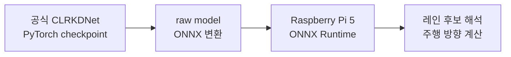

## 들어가며

중간고사가 끝나고 드디어 이 프로젝트를 재개했다.

[[Log 02_아키텍처 설계|지난 포스팅]]에서는 자율주행 과제를 여러 모듈로 나누고, 레인 인식에는 CLRKDNet을 사용하기로 했었다.
그래서 이번엔 이 Lane model을 프로젝트에 도입하는 게 가능할 지 적용 가능성을 보겠다.

---

## 왜 검증?

CLRKDNet의 공개 Git repo에서 가져온 가중치는 [CULane](https://xingangpan.github.io/projects/CULane.html)으로 학습된 ResNet-18 기반 pretrained weight다. 이 CULane은 차량에 장착한 카메라로 실제 도로를 촬영하고, 각 이미지에 차선 위치를 표시해둔 레인 인식 데이터셋이다.

즉, 이 모델이 학습한 원래 도메인은 **실제 도로 영상**이다.

공식 코드는 GPU가 있는 PyTorch 환경을 기준으로 작성되어 있다.
근데 우리 프로젝트 자동차에 탑재한 Raspberry Pi 5에서는 **CPU**로 모델을 실행해야 하고, 카메라 영상도 모델 입력에 맞게 직접 연결해야 한다. 그리고 실제 도로와 우리의 실내 맵은 카메라 시점과 차선의 색·형태도 다르기 때문에, pretrained 모델이 맵의 노란 레인을 인식할지도 확실하지가 않다.

그래서 다른 인식 모듈을 구현하기 전에 레인 모델부터 다음 순서로 검증해보기로 했다:

1. CLRKDNet을 Pi에서 실행할 수 있는 형태로 옮긴다.
2. 카메라 입력과 모델 추론 속도를 각각 측정한다.
3. 프로젝트 맵에서 촬영한 이미지에서도 레인 출력을 얻을 수 있는지 확인한다.
## 1. CLRKDNet의 ONNX 변환

### 1.1. 공개 모델에서 Pi 배포까지

CLRKDNet의 [공식 repository](https://github.com/weiqingq/CLRKDNet)에는 학습과 평가 코드가 공개되어 있다. 근데 공식 추론 과정에는 PyTorch뿐 아니라 CUDA 환경에서 동작하는 연산도 포함되어 있어, 해당 코드를 Raspberry Pi에서 그대로 실행하기는 어렵다.

그래서 Colab에서 공식 config와 checkpoint로 PyTorch 모델을 불러오고, 모델의 신경망 부분을 ONNX로 변환했다. Pi에서는 ONNX Runtime으로 이 파일을 실행하는 경로를 잡았다.

참고로 여기서 ONNX 모델은 완성된 조향값을 출력하지 않는다.
이미지 속에 레인이 있을 법한 여러 후보를 출력하고, 그중 유효한 곡선을 골라 화면 좌표로 복원하는 과정은 모델 실행 이후에 따로 필요하다.

### 1.2. ONNX 변환 결과 검증

이렇게 변환해서 파일이 성공적으로 생성되었다.
근데 이 파일이 출력까지 PyTorch 모델과 같아야 변환에 성공했다고 볼 수 있다. 같은 입력을 PyTorch 모델과 ONNX 모델에 넣어 출력이 얼마나 달라지는지 비교했다.

| 확인 항목 | 결과 |
|---|---:|
| 모델 입력 | `1×3×320×800` |
| ONNX 출력 | 192개의 레인 후보 |
| ONNX 파일 크기 | 43.96 MB |
| 두 출력의 최대 절대 오차 | 약 `2.29×10⁻⁵` |

변환 전후의 출력 차이는 무시할 수 있을 만큼 작았다. 이 결과로 pretrained weight가 정상적으로 로드됐고, **PyTorch 모델의 출력을 유지한 ONNX 파일**을 만들 수 있다는 것을 확인했다.

다음으로 확인해 볼 것은 이 파일이 **실제 Pi 카메라 입력**에서도 충분히 빠르게 동작하는지다.
카메라로 들어온 프레임을 CLRKDNet 입력 사이즈에 맞게 resize해서 input으로 넣고 출력하는 게 잘 되려면 어차피 연결을 해보긴 해야 한다.

---

## 2. 카메라 입력과 Pi 추론 성능

### 2.1. 카메라 해상도와 FoV

자동차에 달려있는 OV5647 카메라는 해상도에 따라 보이는 범위가 달라졌다.

그래서 같은 위치에 인형을 두고 `640×480`, `1296×972`, `1920×1080` 모드의 화면을 직접 비교해 봤다.

|                   `640×480`                    |                   `1296×972`                    |                   `1920×1080`                    |
| :--------------------------------------------: | :---------------------------------------------: | :----------------------------------------------: |
| ![[90_Assets/raw_screenshot_640x480.png\|300]] | ![[90_Assets/raw_screenshot_1296x972.png\|300]] | ![[90_Assets/raw_screenshot_1920x1080.png\|300]] |

`640×480`과 `1296×972`는 센서의 넓은 영역을 사용해 시야각(Field of View, FoV)이 비슷했다.

근데 `1920×1080`은 센서 중앙을 잘라 사용하는 모드라 같은 인형이 더 크게 보이고, 좌우 시야는 좁아졌다.

`640×480`은 CLRKDNet 입력 폭인 800px보다 작고, `1920×1080`은 자동차 앞쪽의 레인을 넓게 보기 어려웠다. 따라서 넓은 FoV를 유지하면서 모델 입력보다 큰 원본을 얻을 수 있는 `1296×972 @ 30fps`를 선택했다.

적어도 모델 입력보단 카메라 출력이 더 커야 정보의 왜곡이 없을 것이라고 생각한 것도 있어서 `640x480`은 제외한 것도 있다.

카메라는 자동차 앞쪽에서 바닥을 내려다보도록 장착했다. 입력 영상은 장착 방향에 맞게 180도 회전하고, CULane의 전처리 비율을 참고해 위쪽 영역을 잘라낸 뒤 `800×320`으로 줄였다.

|             카메라 장착 각도              |             crop 영역을 표시한 입력 화면              |
| :--------------------------------: | :-----------------------------------------: |
| ![[02_camera_mount_side.jpg\|300]] | ![[02_raw_camera_frame_crop_line.jpg\|500]] |

촬영부터 회전, crop, resize, tensor 변환까지 수행했을 때 약 27fps가 나왔다.

카메라 원본은 `1296×972`이지만 모델이 실제로 받는 입력은 `800×320`이며, 이 입력을 만드는 과정은 충분히 빠르게 동작했다.

### 2.2. Pi 추론 속도

이제 이 성능 좋은 레인 모델 추론 속도를 한 번 CPU에서 측정해보자.

이전까지 했던 카메라와 모델 input으로 넣는 파이프라인에 CLRKDNet 추론만 추가했더니, 전체 속도가 크게 떨어졌다.

| 실행 구간 | 평균 처리 시간 | 처리 속도 |
|---|---:|---:|
| 카메라·전처리 | 약 36.5 ms | 27.39 fps |
| FP32 전체 카메라 루프 | 400.32 ms | 2.50 fps |
| Static PTQ INT8 전체 카메라 루프 | 160.41 ms | 6.23 fps |

전처리는 수 ms 수준이었고, 대부분의 시간은 모델 추론에 사용됐다. FP32 모델로는 초당 두세 번만 레인을 판단할 수 있었다.

아직 실제 주행을 평가한 건 아니지만, 카메라 입력보다 **모델 추론이 전체 처리 속도의 병목**이라는 점은 확실하게 알 수 있었다.

그래서 추론 속도를 높이기 위해 테스트 삼아서 학습이 끝난 모델을 INT8로 바꾸는 **Static PTQ**(Post-Training Quantization)도 적용해봤다. 카메라를 포함한 처리 속도는 약 2.5배 빨라졌지만, 일부 CULane 이미지에서는 FP32보다 `no_lane`을 조금 더 자주 출력했다. 한 마디로 정확도가 확실히 깨지기는 했다.

근데 추론 속도가 확실히 빨라지기는 하는지 확인해보려고 했던거라, 결과는 성공적이다.

---

## 3. 프로젝트 맵 이미지 추론

### 3.1. 정지 이미지에서 드러난 실패

이전까지는 사실 프로젝트 맵에 대한 데이터가 아니고 dummy 데이터로 측정만 해본 것이다.

근데 이제 이 CLRKDNet이 우리 프로젝트 이미지를 보고 lane detection을 수행할 수 있을지도 궁금했다.

이걸 하려면 당연히 프로젝트 맵 위에서 자동차가 찍은 데이터가 있어야 한다. 일단 자동차를 주행시키지는 않고, 맵의 직선과 곡선, 교차로에 차를 손으로 놓고 카메라 정지 이미지를 먼저 수집했다. (정지 이미지 수집)

같은 이미지를 FP32와 INT8 모델에 넣어 출력을 확인했지만, 가장 단순해 보이는 직선 구간부터 문제가 발생했다...

|                      모델에 들어가는 맵 이미지                      |                            초기 FP32 출력                            |
| :------------------------------------------------------: | :--------------------------------------------------------------: |
| ![[report_ch04_f04-02_map_straight_preprocess.jpg\|500]] | ![[report_ch04_f04-03_map_straight_pretrained_no_lane.jpg\|500]] |

> 노란 두 선이 분명한 직선 구간에서도 초기 출력은 `no_lane`이었다.

혹시 몰라서 카메라에서 자르는 영역(crop)과 레인 후보를 채택하는 모델 내의 confidence 기준도 바꿔봤다.
당연히 confidence 기준을 낮추면 일부 프레임에서는 중심값이 나오기 시작했지만, 한쪽 선만 잡거나 맵의 주행 중심과 다른 위치를 가리키는 경우도 함께 늘어서 불안정했다.

**단순히 threshold를 낮추는 것**은 해결책이 되지 못했다.

근데 그렇다고 CLRKDNet이 우리 데이터에서 추론을 잘 못하는 이유를 fine-tuning의 부재라고 확정하기엔, 그 후처리 코드 자체를 우리가 임시로 테스트한다고 커스텀해서 작성했던 것이었다. 한 마디로, 우리 구현이 공식 구현 요구사항과 일치하지 않아서 그랬을 가능성도 있다고 생각했다.
### 3.2. 모델과 후처리 문제의 분리
Pi에서 사용한 ONNX 파일은 레인 후보까지만 출력하고, 이를 화면 위의 곡선과 주행 중심으로 바꾸는 과정은 직접 작성한 간단한 후처리 코드가 담당한다. 그래서 추론에서 `no_lane`이 나온 이유는 두 가지일 수 있었다:

1. pretrained 모델이 프로젝트 맵을 레인으로 인식하지 못했다.
2. 모델은 후보를 출력했지만, 내가 작성한 후처리가 이를 제대로 해석하지 못했다.

두 가능성을 구분하지 않은 채 fine-tuning이나 모델 교체로 넘어가면 잘못된 원인을 해결하게 될 것 같아서, 오래 걸리는 파인튜닝 전에 먼저 같은 ONNX 출력을 공식 CLRKDNet 방식으로 해석해 두 가능성을 분리해보기로 했다.

---

## 4. 공식 추론 과정 재현

### 4.1. 공식 구현 재현이 필요했던 이유

여기서 한 재현은 논문의 학습 결과나 benchmark 전체를 다시 만드는 것이 아니고, 공식 repository의 PyTorch 추론 과정을 Pi에서 사용할 ONNX Runtime 경로에 맞게 옮기는 작업이었다.

공식 코드를 보면,
모델 출력에 confidence를 적용하고, 겹치는 후보를 정리한 뒤, 레인 후보를 이미지 위의 곡선으로 복원한다.

근데 내가 ONNX로 변환한 파일에는 이 과정이 모두 포함되어 있지 않았다. 
그래서 입력 이미지의 색상 순서와 값의 범위, 레인 후보의 confidence 계산, 곡선 좌표 복원 방식을 **공식 구현**에 맞췄다.

그리고 이걸 프로젝트 맵에 바로 적용해 보기 전에, 원본 모델이 학습했던 CULane 이미지에서 먼저 같은 결과가 나오는지 확인했다.

### 4.2. CULane과 프로젝트 맵의 Domain Gap

![[report_ch04_f04-01_culane_pretrained_success.jpg]]

> 공식 입력과 후처리 방식에 맞춰 실행한 CULane 샘플. 변환한 ONNX 모델에서도 레인 곡선이 정상적으로 나타났다.

일단 ONNX 모델과 새로 맞춘 추론 파이프라인이 **원래 학습 도메인에서는 정상적으로 동작**한다는 사실은 확보했다.

이어서 바로 같은 파이프라인을 프로젝트 맵의 대표 장면에 적용했다.

|                        직선                        |                       좌회전 곡선                       |                         교차로                          |
| :----------------------------------------------: | :------------------------------------------------: | :--------------------------------------------------: |
| ![[embedded_ai_car_log03_map_straight.jpg\|400]] | ![[embedded_ai_car_log03_map_left_curve.jpg\|400]] | ![[embedded_ai_car_log03_map_intersection.jpg\|400]] |

> 직선과 좌회전 곡선에서는 레인 후보가 나오지 않았고, 교차로에서는 한쪽 선만 따라가는 불완전한 후보가 나타났다.

원래 커스텀 후처리에선 Lane을 아예 detect 자체를 못했었는데, 그래도 아주 조금은 공식 코드를 재현했더니 개선되기는 했다. 근데 그렇다 해도 여전히 너무 추론을 못했다.

이를 통해 결론은 하나였다. 도메인 적응이 안되는 것.

실제 도로와 프로젝트 맵은 카메라 높이, 레인 색과 두께, 도로 폭, 곡률과 교차로 형태가 크게 달라서 추론을 못하는 것이 확실해졌다.
이제 이 CULane pretrained 모델을 그대로 사용하는 대신, **프로젝트 맵의 데이터에 맞게 적응시키는 과정**이 필요해졌다.

---

## 마치며

이렇게 아키텍처 설계했던 것 중에서 레인 모델에 집중해서 검증을 해봤다.

다행인 건, 외부에서 가져온 이 레인 모델을 Pi에 올려서 추론까지는 가능한 걸 확인한 것이다.
물론 Domain Gap이라는 새로운 문제를 발견해 버려서, 이 문제까지 해결되어야 확실하게 프로젝트에서 이 모델을 쓸 수 있다고 말할 수 있긴 하다.

이제 아마 표지판이나 다른 이벤트 처리 같은 작업들은 다 미루고, 당분간은 이 레인 모델 작업에만 집중할 듯 싶다.
