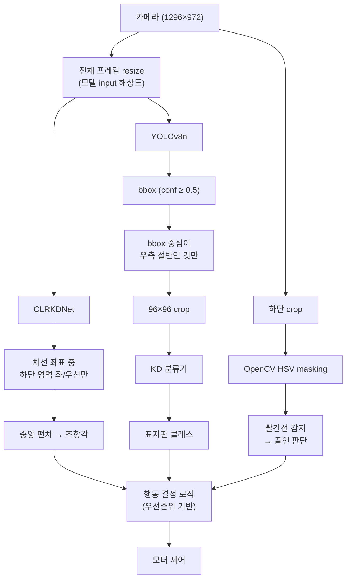

[[Log 02_아키텍처 설계|지난 편]]에서 레인 탐지는 CLRKDNet, 객체 탐지는 YOLOv8n + KD 경량 분류기로 모듈을 확정했다.

여기까진 "종이 위의 설계"다. 설계가 그럴듯해 보여도 실제로 Pi 5에서 돌아가지 않으면 의미가 없다.

- pretrained weight가 실제로 로드되는가
- PyTorch 모델이 ONNX로 export되는가
- Pi 5 CPU에서 목표 fps가 나오는가
- 우리 맵 도메인에 fine-tuning이 현실적인가
- 카메라 입력 해상도가 모델 입력 파이프라인과 호환되는가

이런 질문들의 답이 없으면 "이 아키텍처가 구현 가능한가"에 제대로 답할 수 없다. 이번 편은 각 모듈·파이프라인이 실제로 내 손에서 돌아가는지 항목별로 검증하는 로그다.

검증 실패도 기록으로 남긴다. 실패하면 아키텍처를 수정해야 할 근거가 되고, 그 수정 근거 자체가 기록할 가치가 있다.

---

## 카메라 해상도 확인

> (Q1: 완료)

`rpicam-hello --list-cameras`로 OV5647(Pi Camera Module v1)이 지원하는 모든 해상도·fps를 확인했다.

```
Modes: 'SGBRG10_CSI2P' : 640x480   [58.92 fps - (16, 0)/2560x1920 crop]
                         1296x972  [46.34 fps - (0, 0)/2592x1944 crop]
                         1920x1080 [32.81 fps - (348, 434)/1928x1080 crop]
                         2592x1944 [15.63 fps - (0, 0)/2592x1944 crop]
```

각 해상도에서 같은 위치에 작은 인형을 두고 라이브 프리뷰 스크린샷을 비교했다.

![[raw_screenshot_640x480.png]]
![[raw_screenshot_1296x972.png]]
![[raw_screenshot_1920x1080.png]]

결과:

| 해상도 | FoV | 특이점 |
|---|---|---|
| 640×480 | 넓음 | 어안 왜곡 있음. 해상도 낮음 |
| **1296×972** | **넓음 (동일 FoV) + 해상도 ↑** | 어안 왜곡 있음 |
| 1920×1080 | **좁음** (센서 중앙 crop) | 어안 왜곡 감소 |

1920×1080은 해상도는 올라가지만 센서 중앙 1928×1080만 쓰는 crop 모드라 FoV가 줄어든다. 위 이미지에서 같은 거리의 인형이 1920×1080에선 확대되어 보이는 게 이 때문이다. 차량 시야 확보가 우선이므로 **1296×972 @ 30fps 채택**.

---

## CLRKDNet 입력 파이프라인 (Q2)

> (예정)

CLRKDNet config `ResNet18_CULane.py` 기준:
- 원본 해상도: 1640×590 (CULane)
- 모델 input: 800×320
- `cut_height = 270` — 상단 270px 먼저 raw crop 후 resize

전처리 순서:
```
1640×590 → img[270:, :, :] crop → 1640×320 → 800×320 resize
```

즉 학습 자체가 "상단 crop → resize" 구조다. Pi 1296×972에 같은 비율(270/590≈46%) 적용 시 상단 약 447px crop → 1296×525 → 800×320 resize가 된다. 실제 맵 데이터 확보 후 재검증 예정.

---

## Pretrained Inference 검증 (Q3 · Q4)

> (예정)

- **Q3**: GitHub release에서 `ResNet18_CULane.pth` 받아 Colab에서 CULane 샘플 이미지로 inference — 차선 4개가 정상적으로 그려지는지
- **Q4**: 같은 weight로 내 Pi에서 찍은 1296×972 이미지 투입 — 도메인 gap 1차 증거 확보

결과에 따라:
- 차선 후보가 어느 정도 맞게 뜸 → pretrained 그대로 가능성
- 엉뚱한 위치에 뜸 → fine-tuning으로 해결 가능
- 아무것도 안 뜸 → fine-tuning 데이터·라벨링 필수

---

## ONNX Export 가능성 (Q5) ⭐

> (예정, 최우선)

배포는 ONNX Runtime 가정. CLRNet 계열은 custom op(NMS, line sampling)이 있어 export 실패 가능성이 있다. **실패하면 아키텍처 근본 변경**이 필요하므로 가장 먼저 검증한다.

실패 시 대응 후보:
- (a) PyTorch 직접 Pi에서 실행 (느림 감수)
- (b) 다른 lane detector로 교체 (LaneATT, UFLD)
- (c) Head 부분만 CPU로 분리한 하이브리드 export

---

## Pi 5 추론 FPS 실측 (Q6)

> (예정, Q5 성공 후)

목표: 1296×972 → 800×320 전처리 + CLRKDNet ONNX inference 전체가 < 50ms (20fps).

---

## YOLOv8n Pi 5 벤치마크 (S3)

> (예정)

Ultralytics 공식 Pi 5 벤치마크 검색 + 로컬 실측. 목표 ≥ 5fps (표지판 스레드).

---

## 표지판 최소 인식 거리 (S2)

> (예정, 맵 없이 가능)

표지판 출력물을 1m/2m/3m/4m 거리에 두고 1296×972로 촬영해 글자·기호 식별 가능한 최대 거리 측정.

---

## 단일 vs 2단계 파이프라인 재검토 (S1)

> (예정)

Ultralytics nano 모델로 9클래스 직접 detection이 현실적인지 조사. KD 적용 지점을 어디에 둘지와 얽힘 (Q8 멘토 답과 함께 결정).

---

## ROI 전략 상세 (기존 설계 초안)

> 설계 초안. 위 Q·S 검증 결과로 확정 또는 수정.

ROI는 "관심 영역"이다. 전체 프레임을 매번 통째로 추론에 넣으면 의미 없는 픽셀까지 연산에 포함되고, Pi 5처럼 자원이 빠듯한 환경에선 그대로 fps 저하로 이어진다.

"ROI를 어떻게 적용할지"는 모델 타입에 따라 달라진다. 처음엔 "모든 모델에 해당 영역만 crop해서 넘기자"로 생각했는데, pretrained 모델을 쓰는 경우엔 오히려 문제가 될 수 있다.

### Crop vs Resize + 후처리 필터링

**Crop (입력 자체 자르기)**
- 입력 해상도 자체를 줄여 연산량 최대 절감
- 단점: 잘린 입력은 pretrained 모델이 학습 때 본 형식과 달라 **기하 prior가 깨진다**
    - CLRKDNet의 Line Anchor ray는 이미지 경계에서 발사되는 구조라, 경계 위치가 바뀌면 ray 기하가 어긋남
    - YOLOv8n도 COCO의 전체 씬 context 위에서 학습됐기 때문에, 절반만 crop하면 detection 성능 저하 위험

**Resize + 후처리 필터링**
- 전체 프레임을 모델 input 해상도로 리사이즈 → 출력 결과를 관심 영역 기준으로 필터링
- Pretrained 기하 보존
- 후처리 비용 약간 발생

딥러닝 모델은 **Resize + 후처리 필터링**, OpenCV 빨간선은 **Crop** 유지. OpenCV HSV masking은 pretrained 기하가 없고 pixel-wise 연산이라 crop한 만큼 연산량이 줄어든다.

### 적용 방식 (초안)

| 모델 | 입력 처리 | 결과 해석 |
|---|---|---|
| CLRKDNet | 전체 프레임 → 모델 input 해상도로 resize | 차선 좌표 중 하단 영역만 사용 |
| YOLOv8n | 전체 프레임 → 모델 input 해상도로 resize | bbox 중심이 우측 절반에 있는 것만 채택 |
| OpenCV 빨간선 | 원본 프레임에서 하단만 crop | HSV masking → 빨간선 검출 |

좌표 범위 수치는 카메라 거치 각도·맵 설치 후 확정.

---

## 상세 실행 다이어그램 (초안)



행동 결정은 우선순위 순서로 처리한다.

1. 골인 빨간선 감지 → 완전 정지
2. Stop 사인 → 2.5초 정지 후 재출발
3. 방향 표지판 + 교차로 → 방향 결정
4. 신호등 초록 → 3초 정지 후 우회전
5. 경적 사인 → 부저 1회
6. 감속 표지판 → 속도 감소
7. 기본 → CLRKDNet 조향각으로 레인 주행

---

## 2스레드 구조 (fps 실측 후 재검토)

> 초안. Q6·S3 fps 결과 확인 후 목표 fps 수치 확정.

fps는 1초에 처리하는 프레임 수. 주행 중엔 "카메라로 본 상황에 모터가 반응하는 속도"로 이어진다. 너무 낮으면 선을 벗어나거나 표지판을 지나치고 나서야 반응하게 된다.

Pi 5에서 `레인 추론 → 표지판 탐지 → 분류`를 한 스레드로 순차 처리하면 모든 모델 추론 시간이 누적된다. 가장 느린 모델이 전체 속도를 잡아먹는다.

그래서 분리:
- **메인 스레드**: 카메라 캡처 → 레인 추론 → 빨간선 감지 → 모터 명령
- **표지판 스레드**: YOLOv8n 탐지 → KD 분류기 → 결과 공유 변수 업데이트

레인 주행은 빠르게 계속 돌고, 표지판 인식은 상대적으로 느리게 돌면서 결과를 공유 변수에 써두는 방식. 두 스레드는 `threading.Lock()`으로 동기화한다.

이 구조 위에 Priority Scheduling도 얹을 수 있다. 평상시엔 메인 스레드 우선, 표지판이 화면에 들어온 순간에는 표지판 스레드 우선순위를 일시적으로 올린다.

---

## 경량화 기법 적용 지점

| 기법 | 적용 대상 |
|---|---|
| Knowledge Distillation | CLRNet→CLRKDNet / MobileNetV2→Student 분류기 |
| Channel Pruning | CLRKDNet BN Scaling / 분류기 채널 제거 |
| QAT | 분류기 INT8 TFLite 변환 |
| Priority Scheduling | 2스레드 구간별 우선순위 동적 조정 |

레인 쪽 KD는 이미 CLRKDNet이라는 형태로 공개돼 있다. 내부 구조:

![[Pasted image 20260418115433.png]]
> CLRKDNet의 KD 구조. Teacher(CLRNet, 상단)에서 Student(CLRKDNet, 하단)로 Attention Map(L_att), Prior Embedding(L_prior), Logit(L_logit) 세 증류 손실을 동시에 적용.
> (ref: CLRKDNet, 2024, Fig. 2)

분류기 쪽 KD는 직접 설계해야 한다. MobileNetV2 Teacher + Student CNN에 logit transfer 기반으로 시작할 계획.

> "Pretrained CLRKDNet을 받아 쓰는 것"이 과제에서 요구하는 KD 적용으로 인정되는지는 멘토에게 확인 필요 (Q8).

---

## 마무리

각 검증 항목이 완료될 때마다 이 글에 결과를 추가한다. 미검증 항목은 "(예정)"으로 남겨두고, 막히면 막히는 대로 기록한다. 포스팅 끝 상태는 "이 아키텍처가 Pi 5에서 실제로 구현 가능하다"에 대한 근거의 묶음이 될 예정이다.
