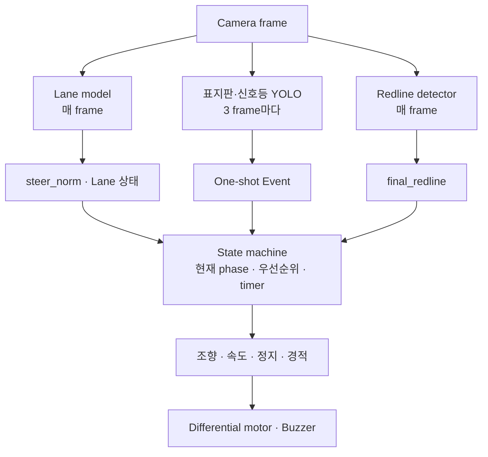
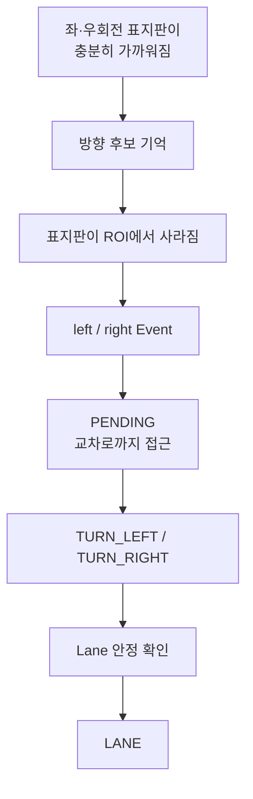
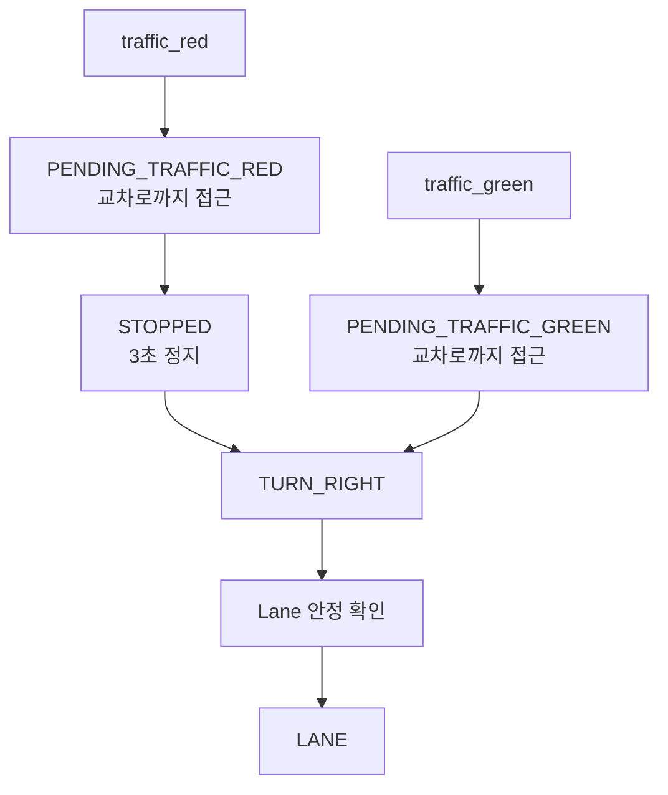

## 들어가며

드디어 마지막 단계다.

Lane model은 매 frame의 주행 방향을 만들고, 표지판·신호등·종료선 detector는 특정 상황에서 한 번 소비할 수 있는 Event를 발생시킨다. 여기까지 각 인식 모듈이 주행 제어 계층과 주고받을 출력은 정리됐다.

이제 이 서로 다른 출력들을 공통 제어 센터에서 처리해서 최종적으로 모터로 명령을 발생시킬 수 있게끔 통합만 하면 된다.

---

## 1. 서로 다른 출력을 하나의 주행 Loop로

통합 Runtime의 입력은 카메라 frame 하나지만, 각 모듈이 만드는 출력의 성격은 서로 다르다.

| 모듈 | 실행 주기 | 출력 | 주행에서의 역할 |
|---|---:|---|---|
| Lane model | 매 frame | `steer_norm`, Lane 상태 | 기본 주행 방향 |
| 표지판·신호등 YOLO | 3 frame마다 | One-shot event | 회전·정지·감속 등 행동 요청 |
| Redline detector | 매 frame | `final_redline` 후보 | 종료 지점 판단 |
| State machine | 매 frame | 조향·속도·정지·경적 상태 | 여러 출력을 하나의 행동으로 통합 |
| Motor·Horn | 매 frame | 좌우 PWM·부저 출력 | 실제 차체 동작 |

Lane은 장면이 바뀔 때마다 조향을 갱신해야 하므로 매 frame 실행한다.

표지판·신호등 YOLO는 [[Log 10_표지판·신호등·종료선 인식과 Event 생성|앞서 만든 Event trigger]]와 함께 사용하고, Lane보다 낮은 주기로 실행해 CPU 부하를 나누었다.

비교적 가벼운 Redline detector는 매 frame 확인한다.

매 Loop에서 State machine은 들어온 Event를 우선순위와 현재 phase에 따라 정리한 뒤 `steer_norm`, 속도 배율, 강제 정지 여부와 경적 상태를 반환한다.

이 결과를 마지막에 좌우 Motor PWM으로 변환하면서, 서로 다른 모델의 출력이 하나의 차체 동작으로 이어진다.

---

## 2. Event를 받아들이는 시점

### 2.1. 표지판을 본 시점과 돌아야 할 시점

앞선 글에서는 거리와 연속 관측을 이용해 detection을 한 번의 Event로 만드는 공통 경로를 구성했다.

근데 통합 주행에서는 Event마다 실제로 발생시킬 시점을 조금씩 다르게 맞춰야 했다.

초기에는 회전 표지판이 가까워지면 곧바로 좌·우회전을 시작하는 방식을 생각했었는데, 카메라가 표지판을 인식하는 위치와 자동차가 실제 교차로에 도착하는 위치는 같지 않았다.
예를 들어, 너무 일찍 돌면 교차로에 들어가기 전에 경계선을 밟고, 시간을 길게 고정하면 자동차 속도와 detection 시점에 따라 회전 위치가 달라진다.

최종 trigger에서는 좌·우회전 표지판이 일정 크기 이상 보이면 먼저 후보로 기억한다. 이후 표지판이 카메라의 ROI에서 사라지는 순간에 event를 발생시키도록 했다. 표지판을 지나친 시점을 회전 준비의 기준으로 사용한 것이다.

Event가 발생해도 바로 강한 회전을 시작하지 않는다. `PENDING` 구간에서는 Lane 조향의 범위를 작게 제한한 채 조금 더 전진하게 했다. 교차로나 분기점에서 Lane 출력이 크게 흔들려도 회전 시작 위치가 너무 달라지지 않게 하기 위해서다.

좌회전과 우회전은 맵에서 표지판과 교차로 사이의 거리가 달랐기 때문에 접근 시간을 따로 조정했다.
회전 역시 정해진 시간만큼 무조건 유지하지 않았다. 최소 회전 구간이 지난 뒤 Lane이 다시 안정적으로 보이면 기본 주행으로 돌아가고, 끝까지 Lane을 잡지 못할 때를 위한 timeout도 두었다.

### 2.2. Event 종류와 우선순위

모든 Event가 Lane 주행을 완전히 대신할 필요는 없다. 정지나 회전은 현재 주행 phase를 바꾸지만, 감속과 경적은 Lane 조향을 유지한 채 일정 시간 효과만 더하면 된다.

| Event 종류 | 대상 | 처리 방식 |
|---|---|---|
| Phase event | 좌·우회전, 정지, 신호등 | 현재 Lane 행동을 다른 상태로 전환 |
| Effect event | 감속, 직진, 경적 | Lane 주행 위에 속도·조향 제한이나 경적 효과를 추가 |
| Terminal event | 최종 Redline | 다른 주행보다 우선하여 자동차를 종료 상태로 전환 |

같은 Loop에서 Phase Event가 여러 개 들어오면 `final_redline` → `stop` → `traffic_red` → `traffic_green` → `left`·`right` 순서로 하나를 선택했다.

`straight`, `speed_20`, `horn` 같은 Effect Event는 이 경쟁에서 제외하고 별도로 적용했다.

일반적인 Phase Event는 자동차가 `LANE` 또는 회전 직후 복귀 구간에 있을 때만 받아들였다. 이미 `PENDING`, `TURN`, `STOPPED` 상태라면 새 Phase Event는 무시한다. 실제 debug log에서도 우회전 중 다시 들어온 `traffic_red`와 `traffic_green`이 행동을 덮어쓰지 않고 무시되는 것을 확인했다.

### 2.3. Event별 상태 전이

시연용 Runtime에서 각 Event는 다음처럼 동작한다.

| Event | State machine의 처리 |
|---|---|
| `stop` | 3초 정지한 뒤 `LANE`으로 복귀 |
| `traffic_red` | 조금 더 접근 → 3초 정지 → 우회전 |
| `traffic_green` | 조금 더 접근 → 정지 없이 우회전 |
| `straight` | 일정 시간 조향 범위를 제한 |
| `speed_20` | 일정 시간 속도를 낮춤 |
| `horn` | 짧게 Buzzer 출력 |
| `final_redline` | 주행 중일 때만 받아들여 `FINISHED`로 전환 |

빨간 신호등은 단순한 정지로 끝나지 않는다. 신호등을 본 뒤 정지 위치까지 조금 더 접근하고, 일정 시간 멈춘 다음 우회전해야 한다.

종료선은 출발 지점과 도착 지점이 같다는 점을 따로 처리해야 했다. 출발 직후에는 `START_IGNORE_REDLINE` 상태로 두고, 이후 `RUNNING` 상태에서 들어온 `final_redline`만 종료 Event로 받아들였다.

---

## 3. 반복 주행과 Event Timing 조정

실제 맵에서 자동차를 굴리면 Event 자체는 맞게 발생했는데 회전을 너무 일찍 시작하거나, 정지 위치가 조금씩 달라지는 문제가 남았다. 어떤 값이 detector의 문제이고 어떤 값이 행동 timing의 문제인지 나눠서 확인할 수 있어야 했다.

### 3.1. 초기 Prototype에서 시연 Runtime까지

첫 통합 prototype에서도 Lane, 표지판과 색상 detector를 하나의 Loop로 실행할 수는 있었는데, 이 상태로 현장 튜닝을 반복하기에는 설정과 debug 경로가 충분히 분리되어 있지 않았다.

그래서 시연 전에는 Runtime 구조 자체를 다시 정리했다.

| 구분       | 초기 통합 Prototype                 | 시연용 Runtime                       |
| -------- | ------------------------------- | --------------------------------- |
| Lane 경로  | FP32                            | QAT-lite `qat_layer4`             |
| Event 인식 | 6-class YOLO + HSV 신호등·종료선      | 8-class YOLO + OpenCV 종료선         |
| 실행 주기    | Lane 1 / Sign 5 / Color 3 frame | Lane 1 / Sign 3 / Redline 1 frame |

Lane model 선택 과정은 [[Log 09_Lane Model 양자화|앞선 글]]에서 다뤘다. 여기서는 최종적으로 선택한 모델과 8-class YOLO, Redline detector를 같은 Loop에서 실행하면서 각 모듈의 주기와 Event timing을 맞추는 데 집중했다.

### 3.2. 설정과 Debug 경로 분리

Runtime 설정도 역할별로 나누었다.

- `lane`, `sign`, `redline`: 모델과 인식 조건
- `state`: Event 우선순위와 접근·정지·회전 시간
- `runtime`, `hardware`: 실행 주기와 카메라·Motor 설정

모델을 바꾸거나 회전 시간을 조정할 때 주행 코드를 직접 수정하지 않아도 되고, 문제가 생긴 모듈만 따로 실행할 수도 있다. Lane-only, Sign log, Redline overlay와 Full-overlay처럼 목적별 debug entrypoint도 분리했다.

![[embedded_ai_car_log11_runtime_overlay.jpg]]

> 통합 주행 debug 화면. Lane polyline과 조향값뿐 아니라 현재 phase, 받아들인 Event, 좌우 Motor 출력과 Redline ROI를 한 화면에서 확인했다. Overlay는 debug할 때만 사용하고 시연용 Runtime에서는 제외했다.

전체 주행부터 반복하기보다 Lane, Sign, Redline을 따로 확인하고 마지막에 Full-overlay로 합쳤다.

Event 목록, 실제로 받아들인 Event, 현재 phase와 Motor 출력을 CSV에 함께 남겨서, 인식 실패와 상태 전이 실패를 분리해서 볼 수 있게 했다.

### 3.3. Event Timing과 차체 반응

현장에서 만지는 값도 역할에 따라 나눴다.

- Event가 너무 멀리서 또는 늦게 발생하면 `sign`의 box 크기와 ROI를 조정한다.
- Event는 맞는데 회전 시작 위치가 어긋나면 `state`의 접근 시간을 조정한다.
- 회전량이 부족하거나 지나치면 회전 조향값과 최소·최대 시간을 조정한다.
- 같은 표지판이 반복해서 발생하면 detector의 cooldown을 조정한다.

차체 쪽에서도 조향값을 좌우 Motor에 단순히 더하고 빼는 것만으로는 큰 곡선을 충분히 돌기 어려웠다.

최종 Motor mapping에는 큰 조향에서 바깥쪽 바퀴를 더 밀어주는 `curve boost`와, 안쪽 바퀴가 지나치게 느려지지 않도록 하는 최소 PWM을 추가했다.

---

## 4. 최종 시연

5월 28일에는 지금까지 만든 Lane model과 Event detector, State machine과 Motor 제어를 하나의 자동차에 올려 최종 시연을 진행했다.

![[embedded_ai_car_log11_final_car.jpg]]

> 프로젝트 맵 위의 최종 자동차. 한 대의 Raspberry Pi에서 Lane, 표지판·신호등, 종료선과 주행 제어를 함께 실행한다.

아래 영상은 최종 시연 촬영본을 직접 1분으로 편집한 버전이다.

![[embedded_ai_car_log11_final_demo_1min_20260528.mp4]]

> 2026년 5월 28일 최종 시연 영상의 1분 편집본.

---

## 마치며

이로써 프로젝트가 마무리 되었다.

길지 않은 프로젝트 기간이었지만, 2배는 더 길게 느껴질 만큼 배운 점도 많았고 경험한 부분도 많았다고 생각한 프로젝트다.

그만큼 Input도 많이 쏟았고, 정말 유의미한 경험이었다.

끝.