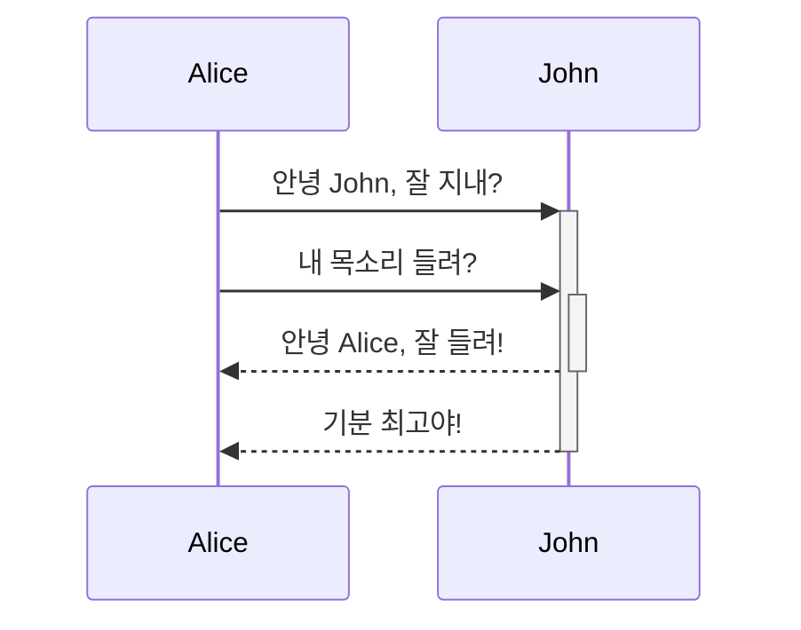

Quartz는 **Mermaid.js**를 지원하여, 텍스트 코드로 흐름도(Flowchart), 시퀀스 다이어그램, 타임라인 등을 그릴 수 있습니다.
옵시디언에서 그린 차트가 블로그에서도 똑같이, 그리고 **사이트 테마(다크/라이트 모드)에 맞춰서** 자동으로 렌더링됩니다.

## 1. 기본 문법 (Syntax)

코드 블록을 만들고 언어 이름을 `mermaid`라고 적으면 됩니다.

````markdown

````

**결과 예시:**
(실제 블로그에서는 아래 코드가 그림으로 변환되어 보입니다.)


---

## 2. 지원하는 다이어그램 종류
Quartz는 Mermaid가 지원하는 대부분의 차트를 그릴 수 있습니다.
* **Flowchart:** 알고리즘 순서도
* **Sequence Diagram:** 객체 간 상호작용
* **Class Diagram:** 클래스 구조도
* **State Diagram:** 상태 머신
* **Gantt Chart:** 프로젝트 일정 관리
* **Gitgraph:** 깃 브랜치 전략 시각화

> 자세한 문법은 [Mermaid 공식 문서](https://mermaid.js.org/intro/)를 참고하세요.

---

## 3. 트러블슈팅 (Troubleshooting)

### Q. 다이어그램이 안 나오고 코드만 보여요!
**플러그인 순서**가 문제일 수 있습니다. `quartz.config.ts` 파일에서 플러그인 목록을 확인하세요.
반드시 **`ObsidianFlavoredMarkdown`** 플러그인이 **`SyntaxHighlighting`** 플러그인보다 **뒤에(아래에)** 있어야 합니다.

```typescript
transformers: [
  Plugin.SyntaxHighlighting(), // 먼저 실행
  Plugin.ObsidianFlavoredMarkdown(), // 나중에 실행 (Mermaid 처리)
  // ...
]
```

